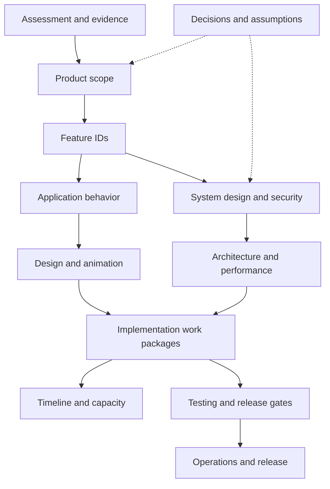

# Slack Vibe: assessment and delivery plan

Assessed **18 September 2026**, against commit **13a87c4**. This documentation remains the scope and implementation authority; the active follow-up has since added verified core DM and all-unread inbox slices, pageable indexed search, bounded old-message context jumps and a repeatable local search benchmark. The latest full run passes 265 TDD tests across 58 files. Five 100k-message local search runs cover short/common terms, filters and concurrent requests; selective warm p50 ranges from 12.08–52.47ms and the natural planner chooses the trigram index in two of five runs. This remains synthetic local evidence, not a production or whole-app 10× claim.

## Start here

**Use the [full delivery plan](delivery-plan.md) for what comes next.** P00–P14 sequence every package, with phase gates, relative timelines, dedicated QA capacity, architecture/performance work and rollback. Its [persistent implementation loop](delivery-plan.md#persistent-implementation-loop) requires every slice to start from the docs and failing tests, then update evidence and select the next unclosed dependency. [Delivery traceability](delivery-traceability.md) maps all 90 capabilities, 108 requirements and 78 routes. [Acceptance cases](acceptance-cases.md) adds 656 concrete planned scenarios, 24 universal case dimensions and 20 cross-domain regressions. A few named slices now have developer test evidence; full independent QA and the complete acceptance catalogue remain unexecuted.

**Browser inspection is now split by environment:** the signed-in GitHub session reaches the local authenticated workspace; the deployed callback result remains an environment-specific release check. See [browser evidence](browser-assessment.md) and the [ordered repair backlog](repair-plan.md). The implementation follow-up has started with TDD, access boundaries, mobile navigation and the core DM workflow; production deployment and production-data tests remain out of scope for this slice.

**A dedicated QA engineer independently verifies every feature and release candidate.** The [QA role and workflow](qa-engineer.md) defines ownership, defect reproduction/retest and sign-off. The [QA execution checklist](qa-checklist.md) covers all 90 features and 78 routes; every entry is currently NOT RUN. The role is added to the plan, not represented as a hired person or completed QA run.

**The whole application must be built with TDD.** [Test-first development](tdd.md) defines red → green → refactor, test layers, coverage and CI gates. The [108-requirement test matrix](test-matrix.md) assigns behavior/failure coverage to every F requirement. Tests are part of each implementation slice, not a final QA phase. The latest full run, `npm test -- --maxWorkers=1 --testTimeout=15000`, passes 265 unit, component and integration tests across 58 files; the full catalogue and independent QA remain open.

The first GitHub Actions workflow is configured in `.github/workflows/ci.yml`. PR #6 passed CI runs [36149667142](https://github.com/kelani34/slack-vibe/actions/runs/36149667142) and [36149672117](https://github.com/kelani34/slack-vibe/actions/runs/36149672117). The later profile-cache candidate, PR #7 at `2622be24a1fde438b87069ac2a7cc4e9a7059002`, passed CI runs [36150550770](https://github.com/kelani34/slack-vibe/actions/runs/36150550770) and [36150575519](https://github.com/kelani34/slack-vibe/actions/runs/36150575519), plus GitGuardian and Vercel preview checks; PR #7 remains open. These are developer/hosted checks, not independent feature QA. Local lint began at 84 errors and 32 warnings and has now been reduced to zero errors and zero warnings. Current lint, typecheck, production build and the full suite pass. Search’s opt-in performance benchmark is separate from that regular suite; independent QA and later release gates remain open.

**Mobile responsiveness is mandatory across every enabled feature and route.** The [mobile specification](mobile-responsive.md) defines phone/tablet layouts, keyboard and safe-area behavior, touch accessibility, media controls and real-device release gates. This applies to mobile web now; dedicated clients are a separate deliverable.

**Start with the [90 numbered application features](features.md#the-actual-product-feature-list).** Each names a concrete user capability and links to its requirement IDs. The catalogue includes [collaboration features](collaboration-features.md), first-class [voice/video and meetings](calls-and-meetings.md), and the broader [community, automation and enterprise platform](production-platform.md). There are **108 engineering requirements and 78 route patterns**; these are separate counts, not substitutes for the product feature list.

Slack Vibe is a substantial Slack-style messaging prototype built with Next.js, React, Prisma/PostgreSQL, and Supabase. It already contains channels, threads, rich text, attachments, search, notifications, bookmarks, and scheduling paths. The remaining work is disproportionately about authorization, reliable delivery, consistent data ownership, and product completeness, rather than adding more screens.

The current DM slice now has its own [direct-message contract](direct-messages.md): one-to-one creation is a distinct `DIRECT` conversation, the sidebar/header/composer identify participants, the responsive inbox supports unread/cursor views, the member directory offers access-checked preselected DM entry, and the member picker can create bounded group conversations. Interactive message retries now also carry a persisted idempotency key across the client cache, database and server action. The document separates those verified changes from the still-planned group lifecycle, privacy controls, calls, offline behavior and governance work.

The latest scope explicitly targets **production-grade Slack/Discord-style communication, including calling and meeting scheduling**. The earlier **one-day delivery target** remains a restricted first milestone, not a cap on the full specification. The user also explicitly requested a **motion-rich, highly polished interface across the app**, with precise and clean animation in every major feature area. [Animation](animation.md) maps that direction to shared motion tokens, a 30-interaction catalogue, feature-specific transitions, reduced-motion behavior, and performance tests.

A one-day effort can target a restricted, verified messaging candidate. The complete product backlog cannot credibly be promised in that window. [Timeline](timeline.md) defines the eight-hour plan, explicit cuts, decision gates, and longer-term estimates. If tenant isolation or message correctness is unresolved, the outcome is an internal candidate, not an external launch.

## Document map

The production-scope follow-ups define [78 route patterns](routes.md) and F49–F108, covering everyday work, collaboration, calling, scheduling, communities, automation and enterprise administration. The registry distinguishes existing, evolved, new and conditional surfaces. The original source audit remains unchanged; [incremental estimates](timeline.md) make the added scope explicit.

| Document | Owns | Read when |
|---|---|---|
| [Full delivery plan](delivery-plan.md) | P00–P14 implementation order, phase gates, capacity and release workflow | Starting or sequencing any implementation |
| [Commit and push workflow](contribution-workflow.md) | Branch, TDD evidence, commit format, pre-push gates and hosted-CI handoff | Preparing, committing or pushing any implementation slice |
| [Delivery traceability](delivery-traceability.md) | All 90 capabilities, 108 requirements and 78 routes mapped to phases/cases | Checking for missing or prematurely closed scope |
| [Acceptance cases](acceptance-cases.md) | 656 planned feature scenarios, universal dimensions, route recipes and integrated regressions | Defining red tests and independent QA procedures |
| [Browser evidence](browser-assessment.md) | Live entry-point inspection and authentication blockers B02/B03 | Restoring authenticated verification |
| [Repair backlog](repair-plan.md) | Ordered fixes for A01–A22 and B02/B03 with regression proof | Fixing current defects before adding dependent features |
| [Assessment](assessment.md) | Current implementation, evidence, defects, verification limits | Understanding what actually exists |
| [Product](product.md) | Audience, goals, scope boundaries, success criteria | Making scope tradeoffs |
| [90-feature catalogue](features.md) | Numbered user-facing features, source coverage, 108 requirements and acceptance criteria | Seeing the full product scope and what remains |
| [Collaboration feature design](collaboration-features.md) | Ten new features: flows, permissions, models, UI, caching and verification | Planning polls, voice, groups, tasks, notes and other expansion |
| [Direct messages](direct-messages.md) | Current one-to-one DM contract plus the group-DM, inbox, privacy, media, offline, mobile and QA exploration backlog | Deciding or implementing any DM entry point, route, notification, file, call or participant behavior |
| [Calls and meetings](calls-and-meetings.md) | Voice/video, huddles, rooms, scheduling, media architecture and artifacts | Designing the live communication product |
| [Production platform](production-platform.md) | Community, roles, guests, automation, identity, migration and clients | Planning the wider Slack/Discord-grade target |
| [Production routes](routes.md) | 78 route patterns, navigation, additional product flows and URL migration | Expanding the complete daily-use app |
| [Application design](application-design.md) | Routes, user journeys, state, behavior contracts | Implementing a feature end to end |
| [System design](system-design.md) | Components, data model, delivery flows, concurrency | Changing backend behavior |
| [Architecture](architecture.md) | Layer assessment, responsibility moves, migration order | Refactoring safely |
| [Security and access](security.md) | Permission matrix, boundaries, privacy and abuse controls | Exposing any read, write, subscription, or file |
| [Performance](performance.md) | Measurement, 10× opportunities, cache matrix, budgets | Improving actual and perceived speed |
| [Design](design.md) | Visual system, responsive layout, component states, UI backlog | Designing or reviewing interfaces |
| [Design implementation audit](design-audit.md) | Current design-system score, verified code gaps, component coverage and ordered design work | Selecting or reviewing a UI/design-system slice |
| [Mobile responsiveness](mobile-responsive.md) | Complete route coverage, compact layouts, keyboard/touch/media behavior and MR01–MR14 acceptance | Designing and verifying every feature on phones and tablets |
| [Animation](animation.md) | Motion tokens, interaction catalogue, interruption and accessibility | Adding or removing motion |
| [Implementation](implementation.md) | Work packages, dependencies, changes, acceptance and rollback | Selecting the next implementation task |
| [Timeline](timeline.md) | One-day execution order and full backlog forecast | Planning capacity and deciding what ships |
| [Testing](testing.md) | Regression scenarios, release gates, performance protocol | Proving a change works |
| [TDD strategy](tdd.md) | Mandatory test-first loop, proposed tools, coverage policy, CI, fixtures and adoption | Starting any implementation, fix or refactor |
| [Requirement test matrix](test-matrix.md) | Planned tests for F01–F108 and route/mobile traceability | Selecting the failing behavior before writing a feature |
| [QA engineer](qa-engineer.md) | Independent verification ownership, handoff, defect lifecycle and release sign-off | Assigning QA and deciding whether a candidate is verified |
| [QA checklist](qa-checklist.md) | Verdict/evidence inventory for 90 features, 78 routes and cross-feature journeys | Executing QA without silently skipping features |
| [Operations](operations.md) | Environments, deployment, recovery and monitoring | Preparing a deployable service |
| [Decisions](decisions.md) | Assumptions, chosen direction, unresolved choices, source references | Resolving ambiguity |

## How the documents connect

## Conventions

- `P00…P14`: ordered delivery phases in [delivery-plan.md](delivery-plan.md); shared W18/W19 run throughout.
- `B01…B05`: browser evidence in [browser-assessment.md](browser-assessment.md); B02/B03 are authentication blockers.
- `TC-Fnn-*`: 656 planned feature scenarios; U01–U24 universal case dimensions and X01–X20 integrated regressions in [acceptance-cases.md](acceptance-cases.md).
- `1…90`: plain-language product catalogue entries in [features.md](features.md), mapped to the F requirements; not a count of pages or infrastructure tasks.
- `F01…F108`: feature requirements, authoritative in [features.md](features.md); F49–F68 add production completeness, F69–F78 add collaboration and F79–F108 specify calls, meetings and platform breadth.
- `R01…R78`: route patterns, authoritative in [routes.md](routes.md), including existing/evolved/new and conditional destinations.
- `A01…A22`: assessment findings, authoritative in [assessment.md](assessment.md).
- `W01…W39`: implementation work packages, authoritative in [implementation.md](implementation.md); W21–W26 estimate production additions and W27–W30 estimate collaboration; W31–W39 cover calls, meetings, platform breadth and previously unestimated capabilities.
- `M01…M30`: motion behaviors, authoritative in [animation.md](animation.md).
- `MR01…MR14`: mandatory mobile acceptance criteria, authoritative in [mobile-responsive.md](mobile-responsive.md); apply to every enabled route and relevant feature package.
- `QG01…QG08`: independent verification gates in [qa-engineer.md](qa-engineer.md); `QF01…QF90` and `QR01…QR78` are execution entries in [qa-checklist.md](qa-checklist.md), not additional features/routes.
- **Observed** means inspected in source or explicitly checked. **Proposed** means future behavior. **Unverified** means external configuration or runtime behavior was not established.
- **Present**, **Partial**, and **Absent** describe source coverage, not percentages of completion. No feature is certified production-ready by this review.
- Estimates are engineering effort, not commitments. No dates are assigned until implementation actually starts.

## Maintenance contract

For each implementation change, update the relevant feature status, work package, and test evidence together. A visible control does not close a feature. Closure requires its access rules, failure behavior, cache invalidation, accessibility, and regression checks. Keep requirements in their owning document and link to them rather than copying competing definitions.

`npm run docs:check` enforces that every Markdown file in this directory appears in the document map, links back to this index, and has no missing local Markdown target. The same command runs in CI. Follow the [commit and push workflow](contribution-workflow.md) for staging boundaries, evidence and remote verification.

The assessment round began documentation-only. Implementation has now started in the authorized follow-up: the TDD foundation, build/type gates, workspace creation membership fix, hook-order repair, message and channel access boundaries, direct-message authorization, and mobile shell affordances are in the working tree. No production deployment or production-data test has been performed. Continue using [delivery-plan](delivery-plan.md) as the implementation authority and keep every unimplemented feature explicitly planned or gated.
