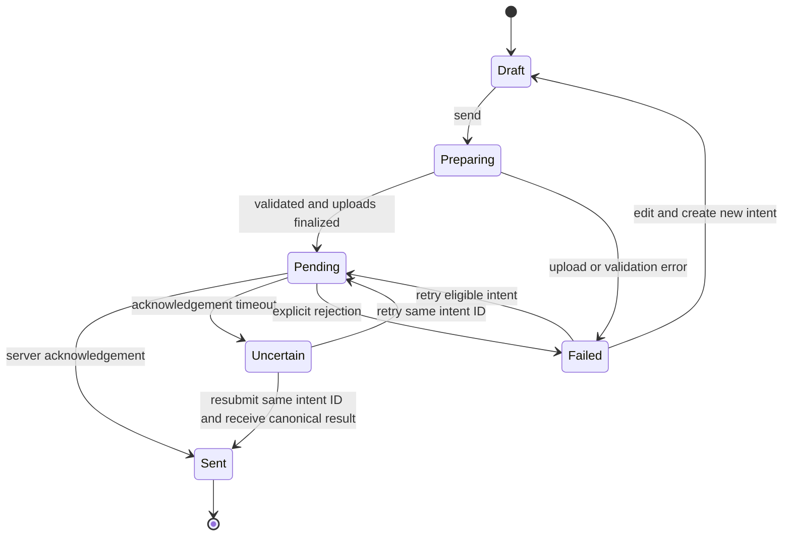

# Application behavior and interaction contracts

The [mobile application contract](mobile-responsive.md) governs every flow below: adaptive single-pane details, predictable Back/focus, keyboard-safe input, explicit touch actions, orientation continuity and phone/tablet failure recovery. Mobile web uses the same domain operations and canonical routes as desktop; layout changes must preserve active drafts, uploads and calls.

The full application now includes [voice/video, rooms and meeting scheduling](calls-and-meetings.md) plus [community and platform workflows](production-platform.md). R59–R78 extend the route map. These documents own prejoin/ringing/live/reconnect/ended flows, event occurrence state, calendar synchronization, artifact consent, forum topics, guest/shared access and workflow/admin journeys. Ordinary navigation retains the active call dock; visiting a call or event link never starts capture or grants access by itself.

[Index](README.md) · [Features](features.md) · [Direct messages](direct-messages.md) · [System design](system-design.md) · [Design](design.md)

The [90-feature catalogue](features.md) defines user capabilities across this application. The [direct-message contract](direct-messages.md) owns F13/F14/F52 participant, inbox, privacy, media and mobile behavior. The ten newest capabilities have detailed [collaboration flows and state contracts](collaboration-features.md), with R53–R58 in the [route registry](routes.md). Polls, voice, acknowledgements and templates extend existing conversation/creation flows; tasks and notes add durable destinations. They inherit the navigation, authorization, failure and cache behavior specified here.

All target behavior below is proposed unless identified as current. The core model is a workspace containing conversations, with a stable conversation timeline and at most one contextual detail surface.

## Existing-route foundation

The table below records the initial route design around the current application. The expanded canonical destination map, new production flows and legacy redirects are now owned by [routes.md](routes.md). Its `/w/[workspaceSlug]` namespace supersedes these paths as the long-term proposal; existing URLs remain valid compatibility entry points during migration.

| Route / surface | Purpose | Access and target behavior |
|---|---|---|
| `/login` | GitHub authentication | Public; preserve a validated same-origin return destination; handle denied OAuth and session expiry |
| `/` | Resolve a useful starting context | One canonical route implementation; choose last accessible workspace/channel, otherwise onboarding |
| `/create-workspace` | Create workspace | Authenticated; transactional owner/default membership; inline validation |
| `/invite/[inviteCode]` | Review and join invitation | Minimal pre-auth disclosure; join only after explicit action; retain destination through sign-in |
| `/[workspaceSlug]` | Workspace landing | Require membership; redirect to last accessible conversation or a useful empty state |
| `/[workspaceSlug]/[channelId]` | Conversation | Verify slug/channel relationship and access before rendering any private header or messages |
| `/[workspaceSlug]/unreads` | All-unread inbox | Show only currently accessible conversations with eligible unread root messages; opening the overview does not advance read state; each action names and marks only its selected conversation |
| `?thread=…` | Selected thread | Parent must belong to active conversation; direct load and Back/Forward behave consistently |
| `?message=…` | Locate message | Authorize, fetch a bounded surrounding window if missing, then scroll and highlight once |
| `/browse-channels` under workspace | Public channel discovery | Workspace member only; distinguish joined/joinable/archived; private channels not discoverable |
| `/members` under workspace | Directory | Workspace-scoped, paginated; user details expose only selected fields |
| `/saved-items` under workspace | Personal saved messages | Personal ownership plus current source access; inaccessible entries do not retain previews |
| `/scheduled` under workspace | Author's pending delivery | Private to author; list explicit states; edit, cancel, send-now when enabled |
| `/settings` under workspace | Workspace and user preferences | Separate workspace-role controls from personal settings; server guards match UI |

Root and `(main)/page.tsx` currently compete for the same logical path. W01 must establish one owner before using a production build as a release signal.

## State ownership

| State | Proposed owner | Persistence and reset |
|---|---|---|
| Current workspace/conversation | URL | Browser navigation; validate access every request |
| Selected thread/message | URL | Shareable; clear invalid selection without revealing target content |
| Profile/channel details/file destination | URL for direct-load routes; local presentation context for panel vs full-page | Follow routes.md; Back restores source; reset on account/workspace change |
| Transient pin/menu surface | Local state or one small Zustand view union | Reset when workspace changes; no separate page for every menu |
| Messages/replies/channel summaries/profiles | TanStack Query | Account/workspace-scoped keys; clear on logout; reconcile events |
| Notifications | TanStack Query after migration | Avoid separate authoritative copies in Zustand and Query |
| Composer text/files | Composer-owned draft | Per account/workspace/channel/thread; in-memory first, opt-in durable drafts later |
| Scroll anchor/unread snapshot | Conversation view | Bounded tab memory keyed by actor/workspace/conversation; restore on history return, keep message content out, separate from live read-cursor updates |
| Typing/presence | Ephemeral realtime state | TTL expiry, cleared on disconnect/scope switch |
| Server permissions | Server result | UI can use capabilities for presentation; never authoritative for writes |

Use a mutually exclusive panel state (`none`, `thread`, `profile`, `channel-details`) rather than unrelated booleans that permit overlapping panels. URL remains the authority for deep-linkable state. Avoid maintaining two sources that continuously write each other.

## Journey 1: authenticate and begin

1. User signs in through GitHub. Successful auth restores an allowed return path, not an arbitrary URL from user input.
2. Resolve memberships and the requested workspace. If no membership exists, show create/join guidance; do not fetch full workspace objects first.
3. On creation, write workspace, owner role, default channels, and creator memberships in one transaction.
4. Show the shell with a meaningful loading boundary while authorized initial messages load. No animation delays first interaction.
5. If an invite is invalid or revoked, show a recoverable explanation. Do not interpret an invalid code as “no workspaces.”

Failure rules: retain typed workspace name/slug; distinguish duplicate slug from network failure; duplicate join is idempotent; prevent double-submit without losing keyboard focus.

The current local auth guard preserves the requested path and query in `callbackUrl`, and the login page passes only a validated local return path to GitHub sign-in. Missing, repeated, absolute, protocol-relative and backslash-normalized external destinations fall back to `/`; an authenticated visit to `/login` also honors only a single safe callback. The login view maps known Auth.js failures to safe, actionable text and uses a generic message for unknown error values. The account-menu Log out item calls Auth.js sign-out and returns to `/login`; component tests and local browser evidence B07–B09 verify its action and subsequent protected-route denial. Expiry behavior, independent QA and the deployed callback remain open.

## Journey 2: read and navigate

The channel header, navigation, and composer remain stable while history loads. New content at the bottom auto-scrolls only when the reader is already near the bottom or intentionally sends a new message. Readers examining old content see a “New messages” control instead of being pulled away.

Pagination records the first visible message ID and its offset before prepending. After insertion and media measurement, restore that anchor. A missing/deleted anchor falls back to its nearest surviving neighbor, not the bottom of the channel. Date dividers and grouped authors are derived from the loaded window and must not duplicate across page boundaries.

Unread state has two roles: a persistent server cursor and a stable entry marker for this viewing session. Mark read only while the document is visible, the conversation is active, and the relevant messages have actually been viewed. A mounting component or open background tab is insufficient.

### Journey 2a: catch up on unread conversations

Open `/[workspaceSlug]/unreads`; the server returns only current workspace/channel memberships and published unread root messages, in bounded pages. Each row identifies its conversation, unread count and first unread destination. Group DMs use the shared layered participant-avatar pattern and accessible participant label. Selecting **Open first unread** navigates to the conversation/message URL so the timeline can load the bounded target context. Opening or refreshing the inbox never advances a cursor. **Mark as read** is a separate, clearly labelled per-conversation action; an error leaves the row and its unread state intact. If access is removed, the row and private summary disappear on the next authorized query. The empty state gives a calm “caught up” result. Mobile layout, live read-boundary races, page-level error recovery and personal mark-unread overrides remain W22 acceptance work; see the [F50 cases](acceptance-cases.md#f50-all-unread-inbox) and [performance/cache contract](performance.md#cache-and-query-additions-for-production-destinations).

## Journey 3: compose and deliver

Proposed state machine:

- Enter sends, Shift+Enter inserts a newline; IME composition Enter must not send. Mention suggestion selection consumes Enter before submission.
- Client feedback appears immediately. Server acknowledgement is a separate fact and cannot be faked by elapsed animation time.
- Keep a retryable copy until acknowledgement. The editor may visually clear after optimistic acceptance, but the outbox row retains original content and finalized upload IDs.
- Edits to failed content create a new intent; retries of the same content reuse the same idempotency key.
- If access is revoked mid-send, display denial, cancel retries, and remove protected cached content. Preserve only user-authored draft content under the chosen draft privacy policy.
- Empty rich-text markup is not a message. Require visible text or a valid attachment. Maximum sizes are defined in [security](security.md).

## Journey 4: threads and profiles

Opening a thread retains main-timeline position and gives the thread its own composer. The parent is loaded independently if absent, but it is authorized against the active channel. Opening a user profile from a thread temporarily replaces the detail pane; Back returns to the same thread state. On mobile, the detail surface replaces the conversation view rather than squeezing two unreadable columns together.

Thread reply counts exclude drafts, hidden content according to policy, deleted rows as specified, and future scheduled messages. A reply must never render as a top-level channel message merely because it arrived on the same realtime table.

## Journey 4a: start and resume a DM

1. The user chooses a teammate from the profile, hover card, Direct messages section or future global compose. Every entry point calls the same server operation and resolves the workspace from the authenticated context.
2. The server verifies both memberships, rejects self/foreign/removed targets, resolves the canonical pair and returns the conversation ID. A double click or concurrent request returns the same ID.
3. The sidebar row and focused header render the selected peer projection: avatar, display name and safe status. Internal `dm-*` names never become user-facing labels; the composer uses `Message <display name>...`.
4. On mobile, the focused DM replaces the list and Back restores the list, filter and scroll position. Opening the route marks only messages that were actually visible as read.
5. If a member is removed or a conversation is no longer accessible, purge protected data and subscriptions, preserve only safe authored draft state, and show a recoverable denial. Do not turn the failure into an empty channel.

Group DMs add a participant revision and explicit history boundary to this journey. Adding a person from the conversation header creates a new generation, and the dialog tells the user that new participants cannot read earlier messages. Adding a person, leaving, removal, rejoin, call admission, search, files and notifications all use that same revision. The complete rules and unresolved choices are in the [DM contract](direct-messages.md#recommended-behavior-contracts).

## Journey 5: retrieve context

Search is workspace-scoped and filters results to channels the requester can read. Keep the last useful results during a new query with a subtle progress label. Only the latest query identity may update results. Results use bounded 20-row keyset pages ordered by `(createdAt,id)`; Load more appends to the current results, keeps focus/scroll stable, and is unavailable while the visible page belongs to a different query. Cursors bind the authenticated actor, workspace and exact query but never replace per-page access checks. Supported filters are `from:`, `in:`, `has:image|file|video`, `is:pinned`, `after:` and `before:`; duplicates, missing values, unsupported enums, invalid dates, reversed ranges, blank searches and inputs over 500 characters show an accessible explanation and never broaden into a different query. Date-only bounds use inclusive UTC calendar days; ISO timestamps require a timezone and compare as exact instants. The parser contract and unit cases live in `src/lib/search-query.ts` and `src/lib/search-query.test.ts`.

A result includes author, channel, time, plain-text excerpt and thread context. Selecting it fetches at most 50 chronological root messages (24 before, the target/root and 25 after), replaces the visible timeline with that page and focuses the target; `Return to latest` restores the prior cached timeline or reloads it. A reply result carries its root thread ID so the reply opens in the thread pane while the root context loads. Do not repeatedly fetch every previous page to find a years-old message. A denied/deleted/future result produces a neutral unavailable state and removes stale excerpts; a transient context query failure has a distinct retryable state.

Pins are channel-owned references; bookmarks are personal references. Both resolve through current source permissions. Forwarding from private content needs an explicit policy and cannot be implemented as unrestricted HTML copy to any target ID.

## Journey 6: schedule and share files

Scheduling shows the user's effective timezone and a concrete date/time before confirmation. Reject past/invalid times and explain ambiguous daylight-saving times where relevant. Pending content is visible only to its author. Cancellation and publication race against the same locked delivery record. Notifications originate from actual publication.

Files have per-item progress, retry, cancel, name, size, and accessible status. Upload completion does not mean message delivery. A finalized file record remains associated with the send intent so retry does not duplicate bytes. Preview/download always rechecks current channel access. Private upload intents bind the authenticated owner, channel, random object path, type, size and two-hour expiry. The browser sends bytes directly to a private Supabase bucket using a path-scoped signed token; finalization rechecks current membership, object existence, exact size/MIME and the first 12 bytes for supported media types. Message creation accepts only uploaded intent IDs and persists server-owned metadata. The app server no longer buffers the upload body. The private bucket is an external deployment prerequisite; one-shot transfer progress/cancel/resume, orphan cleanup, avatar migration and provider-backed browser QA remain open. The private-read action signs a path-bearing attachment only after rechecking current membership and message visibility. Legacy URL-only records remain readable during migration; issued five-minute download URLs cannot be revoked early.

These complete flows are later work unless their release gates fit day one.

## Cross-cutting state vocabulary

| State | Behavior |
|---|---|
| Initial loading | Stable skeleton matching real row geometry; composer availability follows permissions |
| Background refreshing | Retain content; no page spinner or focus reset |
| Empty | Explain what the user can do next, with one relevant action |
| Failure | Inline contextual error and retry; retain recoverable input |
| Disconnected | Clearly mark stale/live status; no false delivery confirmation |
| Denied/revoked | Clear protected records and subscriptions; safe redirect or denial view |
| Archived | Read-only conversation with a reason; every write path respects it |
| Deleted resource | Neutral tombstone or unavailable destination; no endless spinner |
| Concurrent change | Reconcile authoritative version; explain an edit conflict rather than overwriting silently |

## Cross-feature invariants

All message representations agree on identity, publication status, parent, author, attachments, and permissions. Every cache update and animation operates on those facts. UI menus do not expose options that are known to fail, but server authorization still runs independently. A selected UI element stays selected through an update unless the resource ceases to exist or access is revoked.
