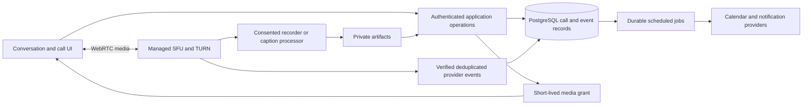

# Voice, video, rooms and meeting scheduling

[Index](README.md) · [Features F79–F92](features.md) · [Routes](routes.md) · [System design](system-design.md) · [Platform](production-platform.md) · [Timeline](timeline.md)

## Product commitment and evidence

The full product target includes voice calls, video calls, huddles, screen sharing and scheduled meetings. These are first-class product requirements, not an undefined future “calls” placeholder. Persistent rooms, stages, captions, recordings and meeting follow-up complete the broader communication experience. They remain planned implementation outside the current messaging slice. On 18 September 2026, a targeted search of package.json, src and prisma found scheduling UI for messages but no RTC provider integration or meeting engine. A calendar component is not a scheduling system; Supabase messaging realtime is not a media transport.

The existing F28 scheduled-message feature remains: compose now, publish a message later. F85/F86 schedule events and recurring meetings; F65 schedules personal reminders. These share a bounded job runner and time conventions where useful, but have different records, permissions and state machines.

## Product model and feature acceptance

### F79 voice calls and F80 video calls

From a DM or group conversation, choose Call or Video call. Show a prejoin device check for first use and whenever permission is missing. Start ringing only after the caller confirms; the recipient may accept, decline or ignore. A proposed 30-second unanswered window produces a missed call, not an error. Accepting on one device resolves ringing on all that person's other devices. Busy users can decline or explicitly leave their existing session; no silent second microphone session. Camera stays off until the user enables it, including when a caller chooses video.

In-session controls: microphone, camera, device selector, screen share, captions when available, participants, conversation thread, quality status and Leave. Desktop uses grid or pinned-speaker layout; on narrow screens one stage plus a participant strip. Muting/unmuting is local-first with transport acknowledgement; a failed device switch preserves the old working device when possible. A moderator can mute or revoke publishing, but can never remotely unmute or activate another person's camera. Leaving stops every local track and prevents reconnect; End for everyone is a separate host action with clear scope.

Acceptance includes denied permission, unplugged headset, output-device unsupported state, incoming call while typing, simultaneous accept/cancel, busy, missed, ended, browser refresh, network handoff, denied rejoin and account removal. Join and ringing notifications obey account interruption policy. Calls work without recording, transcription or AI. Device settings include available echo/noise controls, input meter, push-to-talk and accessible shortcuts; OS/browser support is explicitly tested rather than inferred.

### F81 huddles, F82 screen sharing and F83 persistent voice rooms

A huddle is a transient session attached to a text channel or DM: join from the header/sidebar, discuss in the existing source thread, leave independently, end after the last participant and a reconnect grace period. Enforce one active huddle generation per source so simultaneous starts converge. Membership in the text source is required in the first version; a call invite never reveals that source to a nonmember. Broader guest policy is explicitly governed by F96, not a copied Slack permission assumption.

A persistent voice room is a durable workspace resource with a name, category, join/speak policy and optional occupancy cap. Its media sessions are temporary generations; an empty room stays listed. Users can remain connected while reading other channels, mute/deafen, use push-to-talk and inspect authorized occupancy. A persistent call dock provides return and leave controls across ordinary navigation. Switching workspace must explicitly resolve the active call so scope cannot become ambiguous. No listening or microphone capture occurs merely by visiting a room page.

Screen sharing uses the browser/OS picker after a click. Clearly show what is being shared, Stop sharing, and whether audio sharing is supported. Initial scope permits one presenter at a time with a host-mediated handoff; multi-presenter sharing can extend the tested cap later. Closing the shared window stops its track and restores the camera/participant layout. Viewers can enlarge the presentation without losing audio controls. No remote desktop control is implied. Background blur may be offered only after device-performance validation; it is not necessary for basic calling.

### F84 stages and town halls

A stage uses a persistent room in audience/speaker mode with a scheduled event when needed. Audience grants are subscribe-only. Raise hand creates a deduplicated queue entry; moderators invite a person to speak, and that person explicitly accepts before publishing. Host/moderator privileges have a durable owner-transfer fallback. Removing a speaker revokes media publishing server-side, not just the UI. Locking the room blocks new admissions. Audience count and identity visibility obey the room policy. Stage capacity is independently tested and not inferred from small-call limits.

### F85 meeting scheduling, F86 recurring meetings, F87 calendar connections and F88 RSVP/reminders

Events has agenda and calendar views with bounded date windows. Create with title, optional description/agenda, organizer, source conversation or room, attendees, start/end, named timezone, meeting location and visibility. Locations are an internal call/room, a validated external meeting URL, or a physical location. A source-channel invitation is visible only to members; invitations to outsiders require the explicit guest workflow. A link alone never grants join authority. Hosts can start, reschedule, cancel, designate a cohost and define whether joining before the host is allowed; proposed default is a waiting state until a host starts.

Participants RSVP yes/maybe/no, see their own response and the disclosed participant list, and set supported reminder offsets. A capacity-limited event explains unavailable seats rather than silently accepting too many. Cancellation suppresses queued reminders and closes future join attempts, while retaining an authorized cancellation record. Post-event follow-up links to the existing source thread and permitted artifacts. RSVP is not proof of attendance; provider joins are not proof of attention.

Recurrence v1 supports daily/weekly/monthly patterns, interval, selected weekdays and count/until termination. Store the IANA timezone and wall-clock schedule separately from UTC occurrence instants. Display how a daylight-saving gap/ambiguity will be resolved before saving; proposed policy is move a nonexistent time to the next valid time and choose the earlier offset for an ambiguous time, subject to product confirmation. Monthly day 29–31 skips absent dates rather than silently changing the day. Edits explicitly choose this occurrence or this-and-future; split the series for future edits and preserve past instances. Unique occurrence identity is based on series plus original local recurrence identifier, not mutable UTC start time. Materialize only a rolling horizon and expand bounded calendar windows.

Calendar integration first supports downloadable calendar invitations, then opt-in Google/Microsoft connections. OAuth tokens stay encrypted server-side with least privileges. The user chooses calendars and sync direction. App-managed events have explicit provider IDs/versions; changes imported from providers update only mapped fields. Store sync cursors, renew webhook subscriptions, verify provider callbacks, recover an expired cursor with a bounded resync, and avoid echo loops with origin/version markers. Disconnect revokes tokens and stops sync; disclose whether existing remote events remain. Free/busy exposes availability only with permission, not calendar titles. OAuth and provider API behavior must be verified against selected provider documentation during W32 before implementation.

Reminders use occurrence ID + recipient + offset + event version as the dedupe key. Claim/recheck current event state, RSVP eligibility and authorization before sending. A reschedule invalidates unsent older-version jobs. Retries use one notification intent; do not promise exactly-once external delivery when a provider times out after accepting a request. Apply quiet hours and display delayed notification semantics.

### F89 call history

Provide incoming/outgoing/missed and source/date filters. Rows contain authorized participants, start, duration, final disposition and follow-up links. No recording icon unless an accessible recording exists. Duplicate provider events do not duplicate history. Removed private-channel access hides source context; a person's minimum personal call metadata, if retained, follows an explicit retention policy rather than copying message excerpts. Recurring events link to the specific occurrence. Calling back is a new authorized intent.

### F90 captions, F91 recordings and F92 transcripts/summaries

Captions show live text, speaker labels, language and processing status. Ephemeral captioning and retained transcription are distinct modes, both disclosed to participants. Do not persist captions just because a captions component is open. Users can resize/move the caption area without covering Leave. Show unavailable language, lag and service failure without ending the call. A third-party speech service is an additional data processor requiring a documented selection, retention policy and cost cap.

Recording is off by default. An authorized host requests recording; the product's default policy requires affirmative consent from every current participant before capture begins. Late joiners remain in a prejoin state until they acknowledge capture or decline joining. Consent records identify session, mode, policy version and timestamp. Any participant can request Stop; host/admin policy defines who executes it, and the interface must not imply capture stopped until the recorder confirms. Revoked consent pauses/stops capture before that person's media is included further. This is a product design, not a statement of legal sufficiency in every jurisdiction.

Recordings move requested → capturing → stopping → processing → ready/failed/deleted. A failed recording does not end the live call. Partial artifacts are explicitly labelled and not published accidentally. Playback is private, seekable and keyboard accessible, with captions/transcript when available and expiring media URLs. Access is the intersection of an explicit artifact audience and current source permission; shared-channel artifacts use the bilateral agreement. Retention and deletion cover source files, derived segments, transcript, summaries, search projections and caches.

Transcription is an explicit retained-processing choice. Transcript corrections are versioned; summaries cite timestamped transcript spans, carry an AI-generated label and support correction/regeneration. Action items are suggestions until a user confirms a task and its assignee. Uncertain or unsupported speech is marked, not silently invented. Transcript content is untrusted input: it cannot authorize tools or override system instructions. No automatic external sending or autonomous task execution. A transcript-only mode is allowed without storing raw recording, if the selected processor supports the intended policy.

## Proposed media architecture

Use a managed WebRTC SFU/TURN service as the initial planning assumption; LiveKit is a candidate to validate, not an installed dependency or final procurement decision. Compare regional latency, mobile SDKs, browser coverage, room administration, TURN connectivity, recording/caption integration, data handling, quotas and projected cost before selection. Building peer-to-peer mesh/group media or relaying media through Next.js/Supabase is outside the proposed design. LiveKit documents a selective-forwarding architecture; that supports evaluating it for multi-party media, not a benchmark claim for this app. [SFU reference](https://docs.livekit.io/reference/internals/livekit-sfu/)

The application owns authorization, invitations, event scheduling, source mapping, history and artifact policy. The media provider owns track forwarding and connection state. Provider SDK state owns active tracks; Query owns durable call/event records; transient local state owns prejoin form and panel choices. A single call controller survives conversation route changes and disposes all tracks at actual leave/logout. Do not create independent media clients in each tile, route and sidebar.

Token minting requires a current session, workspace membership, source access, event admission and publish capabilities. Mint opaque room/participant identifiers with short join validity and least-privilege grants. Never accept room names or roles straight from browser input. LiveKit token expiry alone does not evict an already connected participant; reauthorization, permission update and provider-side removal are separate requirements. [Token lifecycle and grants](https://docs.livekit.io/frontends/reference/tokens-grants/)

On membership removal, deny new grants immediately, dispatch provider eviction/permission revocation, retry until acknowledged and reconcile against active sessions. Alert on revocation lag. When real-time eviction cannot be assured, hold rollout for sensitive rooms rather than relying on eventual token expiry. Verify signed provider callbacks and replay identifiers before updating state. Periodic reconciliation repairs missed callbacks. Never let an older room-ended callback close a newer generation.

Transport encryption is required; it is not a claim of end-to-end encryption. E2EE changes key distribution and the ability of authorized recorders/transcribers to decrypt. Define and validate a supported mode matrix before promising E2EE plus recording. LiveKit describes endpoint key responsibilities and distinguishes encrypted media from signaling visibility. [Encryption reference](https://docs.livekit.io/transport/encryption/)

## Proposed data model and operations

| Record | Fields / invariant |
|---|---|
| VoiceRoom | workspace, source/category, kind voice/stage, policy, capacity, archived; durable identity independent of sessions |
| CallSession | workspace, source/room/eventOccurrence, generation, providerRoomId, initiator, state, timestamps; unique active source generation |
| CallInvitation | call, recipient, expiresAt, disposition, version; accepted on one device resolves other devices |
| ParticipantSession | call, user/guest, deviceSession, role, join/leave, provider identity; individual reconnect attempts never create a new person |
| MeetingSeries | organizer, source, title, timezone, recurrence rule, policy, revision; no indefinite eager occurrence expansion |
| MeetingOccurrence | series/original occurrence key, start/end UTC, timezone, exception/cancel/version; stable identity through rescheduling |
| MeetingAttendee | occurrence, user/guest, invitation and RSVP; current admission remains separate from historic response |
| CalendarConnection / Mapping | account/provider, encrypted credential reference, scope, cursor/expiry; event ID/version/origin binding |
| MediaConsent / Artifact | call/user/policy/mode consent; artifact state/audience/storage/retention/sourceVersion; no public URLs |
| ProviderEvent / ScheduledJob | unique event/intent key, attempts, lease, dueAt, revision and outcome; no sensitive payloads in logs |

Operations: start/accept/decline/end call, issue join grant, update publish permission, admit/remove participant, schedule/edit/cancel occurrence, set RSVP, connect/disconnect calendar, request/stop recording, grant artifact playback and request/delete transcript. Writes validate at the boundary and enforce state/version transitions transactionally. Database/provider actions are a retryable workflow, not an impossible cross-service transaction: persist intent, invoke with a stable identifier where supported, reconcile the result, compensate only after checking current generation. An outbox/job record is sufficient until measured scale justifies another queue service.

Call lifecycle: preparing → ringing/waiting → active → ending → ended, with failed/cancelled terminal dispositions. A participant's reconnecting state does not mean the entire call ended. Room occupancy comes from verified participant state, not workspace presence. Event lifecycle: scheduled → live → completed, or cancelled; moving a meeting time increments its revision. A scheduled event never starts microphones automatically.

## UI specification and motion

All calling/event/artifact routes must pass the [mobile media contract](mobile-responsive.md#calls-and-media-on-constrained-screens) and MR01–MR14. Validate actual phone permissions, safe areas, landscape, device routing and background/resume. Preserve a stable reachable Leave action, visible recording status and a usable caption region; compact navigation cannot obscure the call controls or composer. Unsupported browser hardware APIs receive specific fallbacks without disabling ordinary mobile meeting scheduling or playback.

Prejoin places camera preview or initials above labelled device controls, microphone test, privacy/recording notice and Join. The incoming call surface is a compact dismissible banner with caller/source and Accept/Decline; it never steals composer focus. Call sound obeys DND and can be disabled. Caller sees a truthful ringing/busy/missed state.

In-call desktop: flexible presentation stage, stable participant strip, optional conversation/captions panel, fixed labelled control bar. Keep Leave in a consistent position; distinguish Leave from End for everyone. Pinning is viewer-local. Speaker changes emphasize the speaker without constantly reordering tiles. A recording indicator stays visible even when controls auto-collapse. Mobile retains audio/camera/leave controls without requiring hover. A minimized dock shows source, elapsed time and microphone state, not an animated waveform dashboard.

Events: agenda first with optional month/week view; visible timezone and conflicts; create/edit uses a complete page or contextual panel with direct-load fallback. Series edits show exactly what changes. Recordings: paginated private list and player with transcript navigation, source, retention and processing/error states. Forum/stage details follow [platform design](production-platform.md).

Use shared focus, token and motion rules. Device changes, mute feedback and keyboard navigation take effect immediately; animate their visual confirmation in place. Coordinate participant tile entry/exit, stage and dock transitions, screen-share handoff, speaker emphasis, raised hands and caption arrival without moving the participant order unexpectedly. Captions and recording/microphone/network state remain readable and never depend on motion alone. Under reduced motion, preserve a static equivalent and remove travel/choreography.

## Speed, caching, scale and cost plan

Load the RTC SDK and active-call UI only on call intent or accepted invitation; static call buttons must not import the full media stack into ordinary channel startup. Event/calendar lists load a bounded date window. History and recordings paginate metadata; audio/video bytes load on explicit playback. Tokens and live admission decisions are not shared-cache entries. Cached event summaries are account/workspace scoped and invalidated by event revision; calendars never prefetch an unbounded recurrence series.

Proposed validation envelope, not vendor limits: 2-person and 8-person calls, 25 participants with at most 9 visible video subscriptions, one screen share, and a 100-listener stage with at most 4 speakers. Test provider quotas and device/network profiles before exposing each cap. Prioritize audio and presentation; lower video quality or unsubscribe offscreen cameras on congestion. Thumbnail resolution follows rendered size. Monitor decode CPU, packet loss, jitter and reconnection, not just API response time.

Initial measured targets: call-grant p95 under 500 ms on a warm regional app/database, permission-complete join-to-first-audio p95 under 3 s on the declared good-network fixture, ordinary chat typing INP under 200 ms during an 8-person call. These are acceptance hypotheses requiring baseline/trace evidence, not current performance claims or universal network guarantees. Report failure/reconnect rate by supported browser and network condition; recording processing time and caption lag have separate budgets chosen after provider trials.

Estimate monthly cost using participant-minutes, media egress, TURN relay share, recording minutes/storage, transcription minutes and calendar/notification usage. Example sizing fixture: 100 daily callers × 30 participant-minutes/day × 22 days = 66,000 participant-minutes/month, not a price quote. Set room/time/storage caps and per-workspace spend alerts. No pricing or quota is assumed from a stale vendor page. A provider outage preserves chat/events and shows call unavailability; it must not silently switch to an unapproved processor.

## Tests, rollout and operations

Calling/scheduling follows [mandatory TDD](tdd.md) and the [F79–F92 test plan](test-matrix.md). Write deterministic failing state/grant/schedule tests before implementation, then real provider/browser/media tests for the complete boundary. Cover call acceptance/end races, active revocation, recorder consent and recurrence before UI enablement. Fake tracks and provider mocks accelerate the red/green loop but cannot certify real audio routing, TURN connectivity or mobile background behavior.

W31 ships secure voice, then video/share, then huddles/rooms and call history using the same media foundation. W32 adds event scheduling/recurrence and calendar sync on the established join policy. W33 adds captions and explicitly consented artifacts. W34 adds moderated stages on room grants. All features require browser/device and network tests, not just mocked SDK tests.

Release matrix: permissions denied; low bandwidth; TURN-only network; disconnect/rejoin; two tabs/devices; removed membership while active; guest expiry; host departure; old/duplicate/out-of-order callbacks; shared-screen termination; provider outage; recording failure; late-join consent; revoked artifact access; timezone transitions; series exceptions; reschedule/cancel racing reminders; OAuth expiry and sync-loop prevention. Test background behavior on actual mobile browsers and future native clients. Verify captions and control bar with keyboard/screen reader.

Rollout gates: provider choice and region/privacy review → isolated multi-user prototype → current-access and eviction tests → closed-team calls → device/scale evidence → scheduling → recording/caption gates. Rollback disables new sessions or processing; do not kill active calls merely for a UI rollback unless access/security requires it. Provider health, join success, revocation lag, duplicate room creation, stuck recordings, job lag, artifact cleanup and spend need operator visibility. Runbooks cover terminate-room, revoke grant, stop recorder, suppress bad reminders and reconcile provider state without deleting canonical history.

## Product references

Slack's documented huddles combine live collaboration with conversation context; Discord documents scheduled events and moderated stage roles. Those establish relevant product categories, while this project's permissions, capacities and sequencing are proposed separately. [Slack huddles](https://slack.com/help/articles/4402059015315-Use-huddles-in-Slack), [Discord scheduled events](https://support.discord.com/hc/en-us/articles/4409494125719-Scheduled-Events), [Discord stages](https://support.discord.com/hc/en-us/articles/1500005513722-Stage-Channels-FAQ). Reviewed 18 September 2026; exact vendor limits are not copied into this app's promises.
