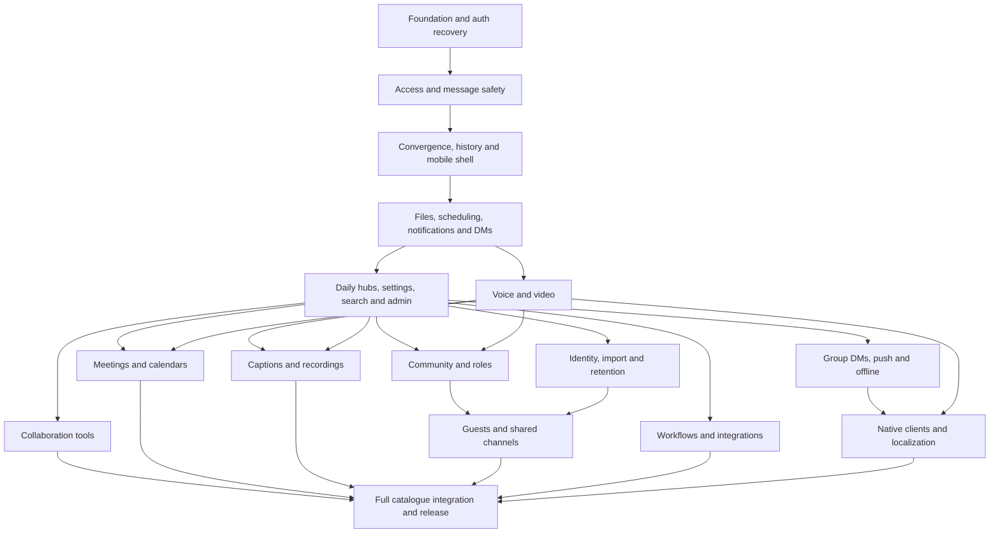

# Full delivery plan: phases, implementation order and verification

[Index](README.md) · [Package contracts](implementation.md) · [Feature catalogue](features.md) · [Direct messages](direct-messages.md) · [Case catalogue](acceptance-cases.md) · [Browser findings](browser-assessment.md) · [QA execution](qa-checklist.md)

## Scope and authority

This is the execution sequence for **all 90 product capabilities, all 108 engineering requirements and all 78 registered route patterns**, including conditional routes explicitly held out of release. It connects the existing specifications into one ordered program. The project is now in active implementation: P00/P01 foundations and access controls, selected P02 mobile work, selected P03 messaging actions, and core F13/F14/F52 direct-message creation, group identity, inbox and bounded-history slices are in the working tree and verified by automated checks. The [DM contract](direct-messages.md) separates that current behavior from the remaining participant revisions, privacy, media, offline and governance work. The plan remains the authority for work not yet implemented; no production deployment or OAuth provider reconfiguration has been performed.

The [feature register](features.md) owns behavior; [routes](routes.md) owns URLs; [implementation](implementation.md) owns package scope and estimates; this document owns cross-package order and milestones; [acceptance cases](acceptance-cases.md) owns the expanded planned cases; [QA checklist](qa-checklist.md) owns actual verdicts. If a later discovery changes a contract, update these together. Never silently shrink the catalogue to fit a date.

**Current status:** local GitHub OAuth is verified through the signed-in browser session, and the authenticated workspace is reachable. The latest full run passes 245 automated tests across 57 files (`npm test -- --maxWorkers=1 --testTimeout=15000`); the focused search/DM/avatar/message-access/context subset passes 83 tests across 10 files. Current typecheck, production build and full local lint pass. Search pagination is actor/workspace/query scoped, typed filters reject malformed input without broadening results, and a PostgreSQL plan regression verifies the GIN trigram path. Old-message navigation uses an access-checked 50-row context window, reply thread identity and retryable load failures. Five opt-in 100k-message local benchmark runs cover six query shapes and an eight-request burst; selective warm p50 ranges from 12.08–52.47ms and natural GIN plan selection varies. Cold/filtered/concurrent production-like latency and independent QA remain open. The Next.js 16 `middleware.ts` convention has been migrated to `proxy.ts`. Protected-route tests cover login matching and preserving the requested path/query; the login action validates a local return destination and rejects external targets; mapped OAuth errors show safe guidance without echoing unknown provider values; and the account menu's Log out control invokes Auth.js sign-out. Browser evidence B07–B09 confirms the local signed-in callback, logout, protected-route denial and reauthentication cycle. Deployed callback, expiry/error recovery and independent QA remain separate gates. It also has verified workspace/channel/message/profile/search/file-upload/direct-message access boundaries, an access-checked member directory with one-click preselected DM entry, a dedicated Direct messages sidebar, a pair-keyed one-to-one model, a responsive DM inbox with bounded activity-cursor pages, participant/latest-message/unread summaries, server-side unread filtering and a member picker for one-to-one and bounded group creation. A partial F50 all-unread route adds authorized 25-row cursor pages, earliest-unread links, explicit per-conversation read controls and empty-state handling; full route acceptance and independent QA remain open. Group expansion, intent-keyed group-creation retry deduplication (including lost-response, concurrency and page-reload recovery), changed/cross-creator key conflicts, private request-hash omission, key cleanup after creation/logout, rename/leave actions with membership checks after a departure, stable participant avatar stacks across the sidebar, inbox and conversation header (including two-member groups after a leave and the one-member group-marker fallback), mobile Back navigation, per-user composer draft restore/clear behavior and logout purge, participant-aware composer identity, focused-conversation realtime hydration with thread/root cache invalidation for published replies, working forwarding, scheduled edit/send-now/cancellation, invite copying, mobile sidebar navigation, bookmark privacy filtering, notification access-filtered pagination and bounded read updates, resilient notification read controls, allowlist-based rich-text sanitization, source-wide icon-control accessible names, shared 44px compact Button/Toggle targets and dynamic viewport bounds for shared Dialog/Popover plus file preview are also covered by implementation tests. Full independent QA remains incomplete; private object delivery/signed URLs, realtime provider policy, calls, meetings, integrations, native clients and the remaining catalogue still require their planned implementation and evidence. Existing source findings A01–A22 are tracked as open until their repair proof and independent QA are recorded in [repair-plan](repair-plan.md). No credible plan can guarantee every unknown future defect is enumerated; this plan covers the defined inventory and requires every discovered case to join the regression suite before closure.

## Live implementation ledger, 25 September 2026

| Workstream | Status | Evidence | Next exit condition |
|---|---|---|---|
| Phase P00 foundation/auth/build | In progress; local gates and latest hosted CI run pass | 245 local tests, typecheck, production build, clean lint, proxy/safe-return-path/logout/draft-cleanup/error-message regressions, local browser evidence B06–B09; GitHub Actions run 36129226838 passed on `0d02ee0` | Verify deliberate workflow failure propagation, expiry/provider-error recovery, deployed callback and independent QA |
| Phase P01 access and safe message model | In progress, core boundaries green | 245 TDD tests across workspace/channel/message/profile/search/file-upload/direct-message/notification/unread access, stable message-send and group-create intent retry dedupe/conflict handling, reload recovery, group avatar states, message HTML sanitization and UI read controls | Independent two-actor browser retest, signed-object delivery, realtime identity and file/privacy checks |
| Phase P02 responsive conversation shell | In progress, mobile shell verified | 390px browser check; accessible sidebar sheet; responsive thread/profile replacement; viewport-bounded Activity/details surfaces; measured light/dark semantic state roles with source-wide raw-color rejection; accessible profile/thread/channel-member skeleton loading with reduced-motion behavior; component-tested reconnect catch-up; actor/workspace/query-scoped search cursors, stable keyset pagination and a PostgreSQL trigram query plan | Light-theme/forced-colors evidence, 320px/tablet/zoom and physical-device checks, keyboard/focus, real network drop/rejoin, reduced-motion browser review, consistent empty/error/denied states, controlled cold/warm search and long-history performance |
| Phase P03 daily messaging actions | In progress, selected slices green | Forwarding dialog, destination permission checks, scheduled edit/send-now/cancellation, access-checked member-directory DM entry, pair-keyed DIRECT DM entry/sidebar and database-bounded inbox, unread/cursor views, one-to-one/group recipient picker, new-generation group expansion, group rename/leave actions, per-user composer drafts, invite copy, bookmark privacy, notification access-filtered pagination/read controls and upload gates | Server-synchronized drafts and private object delivery |
| Phase P04 daily product and administration | W14/F31 search and early W22/F50 all-unread slices in progress; W15/W21 and remaining W22–W26 open | Search has bounded cursor pages, latest-query protection, strict filter validation and a tested PostgreSQL GIN path; F50 has membership-checked unread summaries, first-unread links, explicit scoped read, a page cursor, sidebar badge and core integration/component tests | Normalized plain-text projection, query-result cache, cold/short/common-filter/concurrent measurements, live browser history/focus and unread/read-race journeys, canonical route migration, remaining W14/W15/W21–W26 and independent QA |

This ledger records implementation evidence, not release approval. A green local build does not change the QA denominator for the full catalogue.

## Capacity and relative timeline

`T0` means the start of authorized implementation with named developer and QA owners. No start date or actual staffing allocation has been supplied. The baseline assumes **one developer and a separate QA engineer**, each capable of up to five focused days per week, with QA overlapping development. Each feature's developer estimate includes test-first implementation, review, migration and local verification. QA effort is additional independent preparation, execution, exploration, defect reproduction, retest and regression.

Numbers are low-confidence engineering judgments, not delivery promises. The dedicated QA column is a new provisional capacity allowance, replacing the earlier unestimated QA line. Calibrate it after P02 using observed case complexity, device/provider wait, failure and retest rates. Do not equate one case to a fixed number of minutes, or treat QA effort as a percentage of developer effort.

| Phase | Deliverable | Primary packages | Developer/shared-test days | Cumulative developer days | Independent QA days |
|---|---|---|---|---|---|
| P00 | Authentication and test foundation | W01 | 3.5–7 | 3.5–7 | 1–2 |
| P01 | Access and safe message model | W02, W03, W04 | 5–10 | 8.5–17 | 2–4 |
| P02 | Reliable fast responsive conversation | W05, W06, W08, W16, W17 | 12–21 | 20.5–38 | 4–7 |
| P03 | Complete core communication | W07, W09, W10, W11, W12, W13 | 9–18 | 29.5–56 | 3–6 |
| P04 | Complete daily product and administration | W14, W15, W21, W22, W23, W24, W25, W26 | 19–36 | 48.5–92 | 5–9 |
| P05 | Group DMs, external delivery and offline | W39 | 14–26 | 62.5–118 | 4–8 |
| P06 | Voice, video, sharing, huddles and rooms | W31 | 13–23 | 75.5–141 | 5–9 |
| P07 | Meetings and calendars | W32 | 6–10 | 81.5–151 | 3–6 |
| P08 | Collaboration tools | W27, W28, W29, W30 | 21–36 | 102.5–187 | 6–10 |
| P09 | Captions, recordings and meeting intelligence | W33 | 8–16 | 110.5–203 | 4–8 |
| P10 | Community, advanced roles and stages | W34 | 8–14 | 118.5–217 | 4–7 |
| P11 | Identity, import and retention | W37 | 12–24 | 130.5–241 | 5–10 |
| P12 | Guests and shared channels | W35 | 8–16 | 138.5–257 | 4–8 |
| P13 | Workflows and integrations | W36 | 10–18 | 148.5–275 | 4–8 |
| P14 | Dedicated clients, languages and complete release | W38 | 16.5–34 | 165–309 | 7–14 |
| QA closeout | Final enabled-scope regression, evidence audit and release decision | QG01–QG08 | No extra developer allocation | 165–309 | 4–8 |

**Development/shared-test total: 165–309 days. Independent QA allowance: 65–124 days**, including the final 4–8-day QA closeout reserve and motion-specific review. Combined labor is 230–433 person-days before contingency; this is not elapsed duration. A provisional 20% development contingency yields 198–370.8 developer-days, about 40–75 focused developer-weeks. Allow roughly **41–76 focused calendar weeks for the conservative serial program with one developer and overlapping QA**, including final QA tail, before holidays, reduced allocation, procurement, provider/store approval or unresolved external blockers. This range is a planning envelope, not a statistical confidence interval. It can shrink with validated scope reuse and independent team lanes, or grow after prototypes.

The phase table charges every package exactly once. W20 is a superseded placeholder charged zero. Shared W18/W19 work is embedded as follows: P00 1.5–3d, P02 1–2d, P04 1.5–2d, P06 1–1d, P14 1.5–4d; total 6.5–12d, exactly W18 5–9d plus W19 1.5–3d. These allocations schedule shared work; they do not postpone basic observability, deployment safety or testing until the final phase. Every package still carries its own tests and responsive implementation.

At the baseline allocation, provisional cumulative developer milestones before contingency are: P02 20.5–38d (roughly weeks 4–8), P04 48.5–92d (weeks 10–19), P07 81.5–151d (weeks 16–31), P10 118.5–217d (weeks 24–44), and P14 165–309d (weeks 33–62). Round outward, add risk and QA constraints, and reforecast after each exit gate. These are progress windows, not promises that external dependencies will be ready then.

The earlier [eight-hour candidate](timeline.md#eight-hour-critical-path) is a restricted P00/P01/P02 subset. If authentication, isolated testing or trust cannot pass in that timebox, deliver an internal foundation milestone. The full catalogue is never described as a one-day deliverable.

## Dependency map and safe parallel lanes

This graph shows minimum shared dependencies; the numbered phases define a conservative single-developer order. With a staffed team, media P06 may begin after P03 and W19's operational gate; collaboration P08, governance P11 and integrations P13 can progress on their completed P04 contracts. P12 technically needs W37's settled retention contract rather than all SSO/import UI, but the serial plan completes P11 first to remove that uncertainty. No automated parallel work is scheduled by this document.

Interface agreements before splitting lanes: actor/capability evaluation, published message DTO and intent identity, cursor/event ordering, private object references, notification/job deduplication, session revocation, API error/version shapes and cache keys. A permission change triggers all dependent lane tests. Limit ready-for-QA work to two packages initially; stop starting features if QA backlog grows beyond measured capacity.

## Phase-by-phase implementation and gates

### P00 — Authentication, reproducibility and tests

**Order:** inventory environments and approved test identities → reproduce B02/B03 with sanitized diagnostics → select package-manager authority and establish the isolated test harness/fixtures with proven failure reporting → write failing tests for the diagnosed auth/build defects → recover intended auth configuration → regenerate Prisma client from committed schema and fix root-route/type/lint defects under those tests → complete blocking CI and real provider tests → verify staging smoke/rollback procedure. Harness work may proceed while external auth configuration is being resolved; authenticated QA may not.

**Evidence:** actual GitHub provider round trip in supported environments, state/return-target rejection, expired session/logout behavior, no hidden type failure, intentional failing test blocks CI, passing meaningful unit/component/database/browser tests, isolated fixtures cannot point to production. Existing keys being nonempty does not close auth recovery. Remove build-error suppression only with a green genuine type check. Preserve environment secrets outside docs.

**Exit:** QG01 readiness, repeatable local/staging login, test discovery and failure propagation. **Hold:** unresolved B02/B03, unowned test data, failing build or absent isolated services. Primary requirements F01/F44/F45; foundational work continues later.

### P01 — Shared trust and message safety

**Order:** W02 inventory every exported read/write → central actor/resource predicates and validated relationships → W03 actual identity/RLS/topic proof → W04 transactional workspace membership, safe content, canonical message shape and stable send-intent identity. W03 and W04 can proceed independently after W02; W06 waits for both.

**Evidence:** owner/admin/member/outsider/removed-member matrix at server and transport boundaries; search/files/notifications cannot bypass denial; rendered legacy and new content inert; root/thread/parent invariant; failed creation rolls back; ambiguous acknowledgement produces one stored send. Permission removal is tested with a subscription already open. Use denied server gates for incomplete surfaces.

**Exit:** no unauthorized data leaves any enabled path; allowed two-user read/send works and rejected sends preserve input. A safe transport fallback is explicit if used. **Hold:** unknown deployed policy or unsafe public action remains reachable.

### P02 — Fast, coherent and mobile conversation

**Order:** W05 measured unread/refresh/projection improvements → W06 one event owner and deterministic reconciliation → W08 stable history, thread pagination and target windows. Establish W16 phone shell/composer/focus patterns alongside W04-backed views; W17 builds the shared motion system and each feature applies its own tested transitions after accessible final states are defined.

**Evidence:** duplicate/out-of-order/own-user events, reconnect catch-up, deleted cursor, equal timestamps, preserved scroll anchor and draft; cache cleared on identity loss; cold/warm fixed-fixture query traces; 320px layout, touch, keyboard, IME, text zoom, reduced motion and physical phone checks. Optimize only after the correctness oracle exists. Query-count improvement is not an unmeasured 10× latency claim.

**Exit:** dependable core messaging with one mobile pattern other features can reuse. **Hold:** send loss/duplication, stale private cache, forced scroll, inaccessible primary action or performance regression. Use P02 throughput to revise every later estimate and QA capacity.

### P03 — Complete the core communication contracts

**Order:** W09 private upload/object lifecycle first; W10 actions → W11 notification ownership → W12 unique DMs/forwarding; W13 drafts/profile/hide behavior follows W09's policy. W07 establishes one scheduled-publication worker and due-state model. These packages can interleave once W06 is stable; W07 must precede any claim of scheduled delivery.

**Evidence:** private upload intent/finalization/grant renewal and orphan cleanup; edit/tombstone/pin/reaction/bookmark convergence; notification dedupe and failed optimistic-read recovery; unique DM creation race; forward source/destination policy; cancel/publish/revoke scheduling races; draft/attachment recovery across navigation and failure; status/presence distinction.

**Exit:** all existing core affordances have real behavior and negative tests. **Hold:** future-message leaks, public private-file URL, double publication, DM/private-channel confusion, or placeholder button presented as implemented. Release messaging-only scope only with an explicit feature manifest.

### P04 — Daily destinations, controls and administration

**Order:** W14 secure search/command navigation and W15 administration → W21 canonical/legacy routes, chooser, onboarding and recovery → W22 Home/unread/thread/DM/draft hubs → W23 preferences/revocation/status → W24 files/search/Later/resources → W25 invite/audit console → W26 moderation/data requests/reminders. Independent portions may overlap; W26 waits for W23/W25 and job/privacy contracts.

**Evidence:** every registered destination enabled here has direct-load, refresh, Back/Forward, empty/loading/denied/error and mobile cases. One authorized source contract powers both hub and detail; entering a summary must not mark content read. Session revocation affects open transports; last-owner/invite races are protected; personal reminders and exports recheck access at execution/download. Audit UI grants no hidden private-content authority.

**Exit:** complete everyday web product and safe operator controls. Run the first full feature/route-ledger release rehearsal. **Hold:** route aliases diverge, revocation is cosmetic, data request broadens access, ownership is lost, or required help/recovery has no usable path. Conditional public policy/billing routes are explicitly held out until product decisions and implementation exist.

### P05 — Group conversations, delivery outside the app and offline

**Order within W39:** group-DM participant/history model → atomic group lifecycle and inbox routes → email/push preference/consent and durable delivery intents → provider sandbox/device integration → opt-in bounded offline reads and text outbox → resume/revocation convergence.

**Evidence:** adding participants never unexpectedly exposes old private history; simultaneous group edits preserve the agreed membership version; push preview respects privacy; logout/unsubscribe/invalid token stop future delivery; quiet-hour precedence and retries dedupe; offline pending/uncertain/sent states remain distinguishable. Reconnect reauthorizes before applying queued writes and purges revoked cached content. Browser offline cannot guarantee immediate remote erasure; disclose its bounded retention behavior.

**Exit:** current-access delivery across devices with controlled local persistence. **Hold:** wrong-account notification, silent offline replay, unsupported browser represented as push-capable, or new participant history leak. Native clients cannot close push acceptance before this contract works.

### P06 — Voice and video foundation

**Order within W31:** provider feasibility/security prototype → source-bound admission and active revocation → two-person voice/ringing/accept/end → device selection and reconnect → video with audio fallback → explicit screen sharing → huddles and persistent rooms/session generations → call history/missed outcomes. Prototype evidence uses real media, not a successful mocked token response.

**Evidence:** two accounts/devices; denied mic/camera, missing/unplugged device, network loss and switch, duplicate accept, late webhook, session expiry, removed member, workspace switch and shutdown. Verify blocked networks/relay path where supported, bounded participant subscription and usable Leave on a phone. Record chosen provider limits/cost assumptions before expanding room sizes.

**Exit:** real audio/video transport, correct admission/eviction and coherent call state under failure. **Hold:** unauthorized participant remains connected, controls lose focus, capture continues after stop/leave, or mock-only verification. Recording and speech processors remain a separate P09 gate.

### P07 — Events, recurrence and calendars

**Order within W32:** app-owned event/occurrence identity and join policy → RSVP/cancel/reschedule → versioned reminders → recurrence/exception expansion → export → opted-in provider synchronization and free/busy. Use W26 job ownership and W31 admission, not a second call engine or second notification scheduler.

**Evidence:** invalid times, DST gap/overlap, month-end/leap day, timezone change, single-occurrence versus future edits, removed attendee, organizer departure, cancellation racing reminder, repeated provider callback, revoked connection and reset sync cursor. Calendar text and meeting links retain audience constraints.

**Exit:** one occurrence identity reconciles app, reminder and external calendar state. **Hold:** stale reminder after cancel, divergent recurrence exceptions, calendar loop or join link bypassing access.

### P08 — Collaboration features

**Order:** W27 saved searches → static emoji → polls → keyword notifications; W28 capture prototype → private voice-note upload → accessible playback; W29 groups → bounded publication-time mention expansion → fixed channel templates → versioned acknowledgement; W30 task lifecycle/reminders → versioned explicit-save notes/revisions → search/resource integration. Template task seeding waits until W30; ordinary templates do not require task-engine completion.

**Evidence:** close/vote race, retired emoji fallback, keyword dedupe/mute, lost recording upload and track cleanup, group membership change before scheduled publication, invalid template rollback, edited announcement requiring new acknowledgement, removed task assignee and stale note version. All detail routes retain source access and mobile context.

**Exit:** all F69–F78 contracts work together with messaging, jobs and retrieval. **Hold:** poll privacy leak, accidental recording, duplicate fanout, silent note overwrite or due reminder for inaccessible content.

### P09 — Captions and meeting artifacts

**Order within W33:** processor/data policy and language support → disclosed ephemeral captions → consent state machine → private recording/storage/playback → transcript provenance/correction → summaries → explicitly confirmed task suggestions. No processor becomes enabled simply because live calls work.

**Evidence:** join after capture begins, declined/withdrawn consent, processor outage, partial artifact, delayed callback, speaker/caption lag, unsupported language, edited/deleted source, expired playback grant and prompt-injection text. Summary output cannot execute a task or integration without authorized confirmation.

**Exit:** supported privacy mode, consent and artifact deletion/access contracts verified across all clients. **Hold:** recording before required consent, undisclosed external processing, stale private transcript/search result, or unsupported encryption/caption combination advertised as available.

### P10 — Community, moderation and stages

**Order within W34:** custom capability/override migration and deny precedence → channel categories/personal ordering → forum topics/tags/accepted answers → screening/rules/approval → slow mode/lockdown → automated moderation with failure policy/appeal evidence → stages using P06 transport with separate listen/speak grants.

**Evidence:** no role self-escalation; hidden channels absent from category counts; answer belongs to same topic; rule-version changes; retry/bot/multi-tab cooldown bypass; edit evasion; moderation unavailable path; raised-hand/accept speaker races and immediate speaker removal. Keep human review access bounded to its case evidence.

**Exit:** community growth does not weaken tenant/content boundaries. **Hold:** ambiguous deny precedence, moderation privacy leak or audience can publish media without accepted permission.

### P11 — Identity, import and retention

**Order within W37:** settle retention/hold and identity-binding contracts → additive schema/audit groundwork → one-format dry-run import/mapping → resumable import/quarantine/recovery → selected SSO integration and SCIM lifecycle → retention/hold admin and verified cleanup/restore behavior.

**Evidence:** no historical import alert fanout, archive/path/content limits, duplicate provenance and missing identities, issuer/tenant confusion, SSO replay, provisioning deactivation, last-owner recovery, hold/delete race, derived-object cleanup and restored-data authorization. A hold preserves eligible content without granting the holder content-read access.

**Exit:** actual provider and migration/restore evidence, approved data rules. **Hold:** destructive ambiguity, unbounded import, identity takeover or release requires an untested rollback. External legal/audit approval time is excluded from engineering estimates and remains a visible dependency.

### P12 — Scoped guests and cross-workspace channels

**Order within W35:** guest sponsor/scope/expiry model → guest-aware projections/search/mentions/media → bilateral shared-channel agreement → role/policy intersection → scoped events/files/calls → disconnect/export/retention reconciliation.

**Evidence:** guest expiry in an active call; directory/count/mention privacy; either side changes policy or disconnects while send, upload, invite, workflow, export or recording is in flight; attachment grants and caches cannot outlive current authority. Test two actual workspaces with asymmetric policies.

**Exit:** every derived surface uses the bilateral/current-access predicate. **Hold:** one workspace can grant more than the other permits, previously issued media access persists, or ownership/retention after disconnect is unresolved.

### P13 — Automation and integrations

**Order within W36:** installation scope/authority records and revocation → curated app directory/install lifecycle → verified inbound webhook/command identity → bounded outbound delivery → finite versioned workflow triggers/conditions/actions → execution history/retry/cancel. Reuse existing job/notification foundations and current capability evaluation.

**Evidence:** signature/timestamp replay, cross-tenant command, SSRF/redirect/DNS rebinding test fixtures, scope change, revoked installation while job waits, loop cap, partial success and uncertain external side effect. Do not retry an uncertain non-idempotent third-party action blindly.

**Exit:** each integration's effect and audit result is attributable and recoverable. **Hold:** external data leaves permitted scope, arbitrary code execution is introduced, or automation bypasses archive/slow-mode/current permissions.

### P14 — Native clients, language and full-target release

**Order within W38:** choose supported first platforms via media/push/signing prototype → stable API/deep-link contract reuse → signed client auth/safe credential storage → lifecycle/offline/push/media adaptation → controlled update/recovery → UI localization/RTL/text expansion → opted-in message translation → cross-platform full release rehearsal. Extract translation-ready strings as earlier features are built; do not defer every layout adaptation to this phase.

**Evidence:** physical target devices; OS suspension/resume, push open from closed app, permission revoke, transfer between devices, secure logout, deep-link validation, interrupted update, media interruption and background constraints; RTL mixed content and expanded labels; translation tied to current source version and audience.

**Exit:** every enabled catalogue capability and route has current independent QA evidence, supported platforms declared and QG01–QG08 closed. R52 billing remains conditional unless separately specified; OUT OF SCOPE is never called PASS. Web-mobile F40 must already be complete in earlier phases. **Hold:** native smoke alone is used as whole-app certification or translation bypasses data policy. Store/signing/provider waits may change the calendar.

## Universal implementation slice

Each package is decomposed into small behavior slices following this exact order:

1. Select F/R/A/B/MR IDs, actor/visibility policy, input bounds, state transitions and relevant case IDs. QA reviews the oracle before coding; unresolved required behavior blocks that slice, not unrelated prepared work.
2. Prepare isolated fixture and name the externally observable result. Write and run an intended failing regression/behavior test. For a refactor, capture passing pre-change characterization before moves, then retain it.
3. Implement permission/data invariants and compatible migrations first, then the operation/worker/provider contract. Add idempotency and version checks at the actual state-changing boundary.
4. Implement Query/cache/event handling, failure recovery, responsive UI and precise feature-owned motion against that contract. Animate confirmed state transitions without delaying operations or hiding failures.
5. Prove happy, denial, validation, failure, retry/race, cache/revocation, navigation and applicable device/performance cases. Capture red/green and diff/coverage review at the candidate commit.
6. Independently QA the actual running candidate. File defects with expected/actual, fixture, steps, device and sanitized evidence. Add a failing regression before each fix; QA retests that fix plus affected journeys. Developer green is necessary, not independent sign-off.
7. Rehearse migrations/rollback and update feature/route verdicts with exact build/schema/config/flags. Enable the slice only when its gates pass; preserve old records and secure denied behavior on rollback.

Definition of Ready: acceptance oracle, dependencies satisfied, fixture access, migration/rollback plan, chosen test layers, assigned developer/QA and known decisions. Definition of Done: implementation and mobile states, all applicable cases passing, no unresolved acceptance failure, independent QA, operations evidence and linked docs. No "test later" column is allowed.

## Persistent implementation loop

This is the active execution loop for the complete product objective; a passing slice advances the queue and never closes the program by itself.

1. Re-read the current feature/route/repair state and the owning product, application, system, security, design, mobile, motion, performance, TDD and QA contracts. Resolve conflicts by updating the owning source and its trace links before coding.
2. Select the highest-priority dependency-ready acceptance that still lacks implementation or authoritative evidence. Preserve all 90 features, 108 requirements, 78 routes and the explicit call, meeting, mobile, animation, speed and QA scope; do not shrink the denominator to fit a turn.
3. Set the actor, resource, states, failure modes, privacy boundary, responsive behavior and measurable performance expectation. Write and run the intended failing test at each required layer before changing production behavior.
4. Implement the smallest complete vertical slice, including data migration and rollback where needed, accessible/mobile UI, cache/event ownership, safe motion and failure recovery. Keep permission checks at the server boundary.
5. Run focused tests, relevant integration/browser/device checks, typecheck, lint and production build; then run the whole suite. Treat unavailable external/provider/device evidence as open, never inferred PASS.
6. Update the feature and requirement status, acceptance evidence, route/mobile ledger, package/timeline, architecture/system/security/design/motion/performance/operations docs as affected, and the decision log. Validate cross-document IDs, counts, links and phase arithmetic.
7. Review the diff and evidence, stage explicit paths, commit one coherent slice using the [commit and push workflow](contribution-workflow.md), run the pre-push gates and push the named branch. Verify the remote branch and hosted workflow; local success is not hosted CI evidence.
8. Close only the cases actually proven, then immediately select the next unclosed dependency-ready item and repeat. Keep blocked external gates visible while continuing independent work. Do not stop on a focused green test, a completed phase subset or a turn boundary; complete the full requirements and QG01–QG08 audit before declaring the program done.

## Architecture and performance sequencing

Keep Next.js/Prisma/PostgreSQL/Supabase/Query until measured evidence justifies replacement. P01 extracts shared access and safe serialization from exposed actions; P02 establishes one realtime/cache owner and stable pagination; P03 separates internal notification/publication/file responsibilities; P04 unifies route loaders and preferences; P06/P07 add explicit media and calendar boundaries; P09/P11 add derived-data retention; P13 adds bounded integrations. These are responsibility changes, not a compulsory folder rewrite. Read [architecture](architecture.md) and [system design](system-design.md) before moving code.

Performance work is continuous: establish cold/warm and mobile fixtures at P00/P02; fix N+1 unread and refresh amplification before distributed caching; scope Query keys by actor/workspace/resource, invalidate on permission/content changes and clear on logout; lazy-load heavy editors/media/optional routes; measure bounded history before virtualization; private downloads use short grants; background media/calendar/workflow processors stay off the send critical path. Search caches carry current access; authentication/authorization failures are never masked by cached success. See the authoritative [cache matrix and budgets](performance.md).

For each speed claim report baseline/candidate build, fixture volume, device/network, cold versus warm, sample count, median/p75/p95 where appropriate, request/query count and errors. A 10× goal is satisfied only for the measured operation with equivalent correct behavior, not for the whole app by extrapolation. Any faster path that leaks data or loses messages fails.

## Browser and device execution order

1. Close B02/B03 and verify actual login/logout/session recovery in local/staging/production smoke environments as authorized. Record configuration/build context without secrets.
2. Run owner onboarding, workspace/channel creation and member invitation in disposable staging; verify a second actor and outsider before broader data fixtures.
3. Exercise message, thread, edit/reaction/pin/save, unread, reconnect and private-channel revocation with two independent accounts and same-user tabs.
4. Exercise uploads/downloads, scheduling, DMs/forwarding, search and derived inboxes; verify durable state through actual server/database test assertions, not a toast alone.
5. Sweep each enabled route through direct load, refresh, navigation, denied/not-found/error states and phone/tablet/desktop layouts. Physical iPhone/Android checks cover keyboard, capture, permissions and OS interruption; emulation alone cannot close them.
6. For each later phase add actual media/calendar/notification/identity/provider sandbox checks. Deterministic stubs cover fault injection and CI; real providers cover protocol/device behavior. Both are required where applicable.
7. Execute the ten [integrated QA journeys](qa-checklist.md) plus the [cross-domain interactions](acceptance-cases.md#cross-domain-regression-scenarios), then inspect artifacts, console/service errors and budget results for the candidate. Record FAIL/BLOCKED/NOT RUN honestly. Avoid broad browsing of real private content as test data.

## Release gates and defect handling

Every phase exits through QG01 readiness, QG02 behavior, QG03 privacy, QG04 failure/data integrity, QG05 mobile/accessibility, QG06 regression, QG07 performance/operations and QG08 independent sign-off, limited to its declared enabled scope. Full target release closes all catalogue contracts; staged release keeps future entries explicit. A conditional route may be OUT OF SCOPE with reason and owner, never a fabricated pass.

The [repair ledger](repair-plan.md) maps every A01–A22 and B02/B03 to phase, test-first fix and proof. A source finding is not closed by rewriting documentation. Critical/High defects block the affected release; acceptance-failing Medium defects remain failed until corrected; cosmetic Low issues may carry a named disposition. After fixes, rerun the specific case, its shared boundary matrix, impacted route/device paths and integrated journey. Preserve earlier run history.

Rollout order: isolated development → migration rehearsal/seeded staging → independent QA → small permitted cohort → observe agreed error/privacy/delivery thresholds → broaden. If gates fail, disable the feature at UI and server/worker/transport boundaries, pause new jobs, retain records and revoke unsafe active access. Use forward-compatible schema changes; do not drop data or restore permissive authorization as rollback. Actual external release remains an implementation-session action.

## Decision deadlines and next concrete work

Before P00: name developer/QA, test environment and fixture authority; confirm runtime/package manager and intended auth origins. Before P01: public-channel read-before-join and private-admin access rules. Before P03: upload limits/scanning, edit/delete policy and scheduling worker ownership. Before P05: offline retention and notification processors. Before P06: provider, participant limits, regions and budget. Before P07: recurrence semantics and calendar provider. Before P09: recording consent, processors, encryption mode and artifact retention. Before P11/P12: identity, import format, retention/hold and bilateral ownership. Before P14: platform list, localization languages and distribution. Use [decisions](decisions.md) to record outcomes and re-estimate affected work.

**Next concrete tasks:** the expanded fixed-fixture search benchmark is complete for six query shapes, five runs and an eight-request burst; preserve its plan variability in [performance evidence](performance.md) and collect production-build/device measurements before choosing normalized plain text or result caching. B11 now verifies route-level Back/Forward from All Unread to Members in a separate local tab. Next, cover W08/W14 deep-link history through search, saved items and notifications, restoring query/target, focus and viewport on desktop and mobile without reading or mutating unrelated private content. Component regressions cover deep-link removal and viewport restoration after route remount. Hosted GitHub Actions runs now pass for the pushed candidate; deliberate failure propagation remains a separate open gate, and action runtime majors are contract-tested after the Node 20 deprecation warning. B07–B09 cover the local callback/return, logout and protected-route denial cycle. B10 found a local-only callback on the account's `slack-vibe` OAuth app, but the deployed environment's client-ID pairing remains unknown; identify the exact registration, obtain action-time authorization before changing its redirect settings, then verify deployed return, expiry and provider-error recovery independently. Local evidence does not close authentication or independent-QA gates.

At each phase report actual elapsed/developer/QA effort, F/R/case IDs closed, fresh evidence counts, unresolved defects, measured speed and the next unblocked slice. Recompute remaining effort from completed acceptance, not a guessed completion percentage.

## Validation of this planning revision

Documentation checks verified the current 649 unique feature case IDs, including the new F14 retry case; 90/108/78 inventory sets, all W package allocations, all 24 repair entries, cumulative phase/QA arithmetic and the unchanged 168 NOT RUN independent-QA entries. They validate documentation consistency only, not security, performance, mobile behavior or production readiness. Browser observations and their limits remain in [browser-assessment.md](browser-assessment.md).
