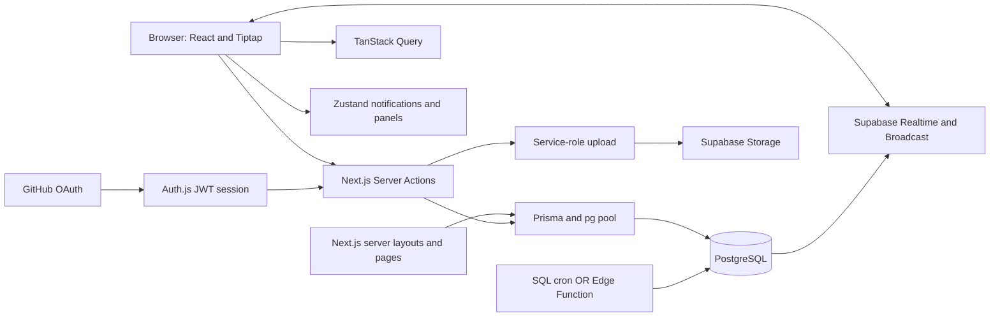
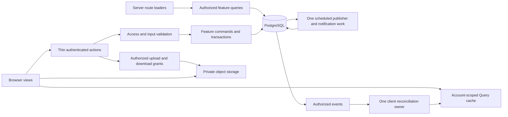
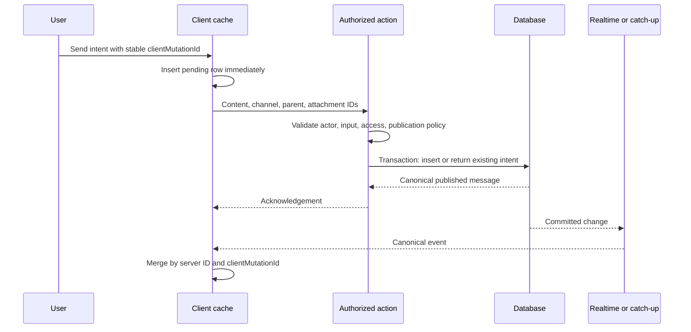

# System design

[Index](README.md) · [Architecture](architecture.md) · [Security](security.md) · [Performance](performance.md) · [Operations](operations.md)

## Direct-message boundary

The [DM contract](direct-messages.md) is the detailed design for F13/F14/F52. One-to-one conversations use the existing channel/message pipeline with an explicit `DIRECT` kind and a server-owned unordered pair key. Group DMs extend the same pipeline with versioned participant state and a history boundary; they do not create a second message table or bypass channel authorization. Inbox summaries, presence, typing, notifications, files, calls, offline outbox, mobile navigation and retention each remain explicit contracts rather than implicit side effects of a DM row.

The current implementation has the `DIRECT` enum migration, a durable pair-key constraint, access-checked pair creation, a bounded group/inbox slice and selected peer identity projections. Group-create retries now persist an actor- and workspace-scoped client intent, reconcile through a unique key and keep the request hash out of ordinary reads; adding someone creates a new conversation generation, with a test proving no old messages become visible to the new member. Legacy `dm-*` ambiguity, in-place participant revisions and derived-read coverage across search, files, notifications, links and media grants remain hardening work. The implementation must preserve one Query/realtime reconciliation owner and one message mutation contract across channels and DMs.

## Additional collaboration domain contracts

[F69–F78 system specifications](collaboration-features.md) extend this design with polls/ballots, versioned announcements/acknowledgements, workspace emoji/groups, channel tasks/notes and personal keyword/search records. Voice notes will use the private attachment lifecycle only after W09 closes; new private-upload references now exist, while legacy URL-only rows and the avatar uploader remain. Fixed templates use versioned application configuration. That document owns proposed fields, transactional invariants, states, events and per-feature failure behavior. No new datastore or transport is proposed.

These are source-channel-scoped features: a task, ballot, note revision or acknowledgement lookup must authorize its parent, not only its supplied ID. Publication expands group recipients and matches keywords after the canonical message is durable; retries deduplicate notification intent. Poll close/vote, note save/version and announcement edit/acknowledgement are explicit concurrency boundaries. Rollback preserves their data and disables affected writes independently.

## Live media and expanded platform boundary

The full target adds a justified external media plane: a selected managed WebRTC SFU/TURN service carries audio/video/screens, while the application remains authority for membership, admission, schedules, history and artifacts. Supabase realtime continues carrying application events; it does not carry video frames. [Calls and meetings](calls-and-meetings.md) specifies topology, CallSession/VoiceRoom/event/consent records, token grants, provider reconciliation and calendar jobs. The earlier single-app recommendation still applies to business logic, not to implementing media transport inside Next.js.

[Production platform](production-platform.md) specifies scoped role/guest/shared-channel models, forum metadata, workflow runs, installations, identity mapping and governance. Use a durable outbox/job record for asynchronous cross-provider intent and reconciliation. No database transaction can atomically commit an external calendar, room or notification operation; retries and uncertain results are explicit. Data processors and credentials have owners, scopes, retention rules and cost limits.

## Boundary and design goals

Every domain contract below is developed [test-first](tdd.md) using its [F requirement matrix](test-matrix.md). Tests exercise actual transaction isolation, uniqueness, current authorization, event ordering and retry behavior. Capture provider intents and reconcile ambiguous outcomes in deterministic contract tests, then verify the selected service in an isolated environment. Schema/policy changes require migration and negative access tests before enabling their dependent features.

Retain one Next.js application and one PostgreSQL source of truth. Keep Supabase Storage and Realtime where they can be secured with verified user identity. Do not introduce microservices, a second business database, Redis, a message broker, or a generic repository layer for ordinary messaging without measured need. The full-target media provider boundary is specified above. Background publication is a bounded workload, not a reason to split the entire application.

The target must preserve tenant isolation, ordered history, retry safety, private scheduled drafts, and fast ordinary reads. These are required regardless of deployment provider.

## Current topology

The source does not demonstrate that Auth.js identity is carried into Realtime authorization. This is a trust-boundary gap, not a diagram connection that can be assumed.

## Proposed topology

Authorized events can initially be scoped Postgres Changes if policies and identity work correctly. Private Broadcast requires its own topic policies. They are different mechanisms and must not be treated as interchangeable security configurations. Day one may use authenticated foreground polling if the realtime proof fails.

## Trust boundaries

1. Browser input enters actions: validate once with existing Zod, resolve the actor from the session, and enforce domain permissions.
2. Server route reads: use the same authorization policy before serializing any record. Return explicit public projections rather than entire Prisma user/workspace records.
3. Realtime transport: authenticate subscription identity and authorize every exposed topic/table. Payload filtering in browser JavaScript is not access control.
4. Storage: authorize signed-upload intent and finalization against account and conversation scope, transfer bytes directly to private storage, attach only one-use finalized intent IDs, and reauthorize every short-lived download grant. An arbitrary supplied URL is not proof of file ownership. The service-role client only issues path-specific upload/read grants and verifies metadata; it never enters the browser.
5. Worker: authenticate invocation, claim work transactionally, recheck publication permissions, and make retries safe.

## Current data model and required evolution

| Entity | Existing role | Proposed changes / invariants |
|---|---|---|
| User, Account, Session, VerificationToken | Identity/profile/Auth.js persistence | Keep provider credentials server-only; selected profile projections; generated client/schema parity |
| Workspace | Name, slug, owner ID, invite code | Enforce owner membership consistency; decide invite visibility/rotation; avoid serializing invite code with generic workspace summary |
| WorkspaceMember | Workspace role | Unique account/workspace; last-owner protection; revocation drives cache and subscription purge |
| Channel | Public/private, creator, archive, posting permission | Distinct conversation kind for DMs; non-null direct key identifies one-to-one and null key identifies a group regardless of current participant count; unique nullable creation-intent UUID plus private normalized-request hash make group-create retries idempotent; both retry fields are omitted from ordinary reads; name semantics separated from DM display; consistent permission policy |
| ChannelMember | Membership and `lastViewedAt` | Monotonic read cursor; no cross-workspace members; future message visibility excluded; group lifecycle/history boundary when enabled |
| ChannelPostingAllowedMember | Selected posters | Validate members belong to channel/workspace; selected policy shared by all write paths |
| Message | Sanitized HTML, parent, schedule, pin/edit/delete flags | `clientMutationId` is unique per author; a server-only request hash rejects key reuse with changed payload; safe content; explicit publication state; deterministic `(createdAt,id)` ordering; parent/channel invariant; `pg_trgm` GIN index supports current `ILIKE` substring search |
| Attachment | Optional legacy URL, MIME, name, size, optional bucket/path, and one-use upload-intent relation | New records use private object keys; upload intent stores owner/channel, expiry and verification state. Signed upload/download tokens are derived bearer grants, never canonical records. Legacy URL-only rows remain readable during migration |
| Reaction | Unique message/user/emoji | Idempotent desired-state updates; channel access checked |
| StarredChannel / BookmarkedMessage | Personal references | Current membership checked at read time; unique constraints support idempotent operations |
| PinnedMessage | Channel reference plus pinnedBy | Message/channel equality; avoid independently mutable duplicate pin truth |
| Notification | User/actor/type/polymorphic resource | Add workspace/channel context and event dedupe key; authorize resource previews; index bounded reads |
| HiddenUser | Personal display filter | Define global versus workspace scope; not a blocking/security mechanism |

### Message publication model

Propose `publicationStatus` with `SCHEDULED`, `PUBLISHED`, `CANCELLED`, `FAILED`, plus immutable creation time, `scheduledAt`, nullable `publishedAt`, and monotonic `version`. A claim can use a row lock inside a transaction without inventing a public `PUBLISHING` state. Add worker attempts/error metadata only for failures requiring retry visibility.

An alternative separate ScheduledMessage table can isolate drafts more strongly, but requires content/attachment migration. Prefer explicit status on the existing Message table for this codebase, conditional on all RLS/read/event predicates enforcing it. Decide once in W07; do not run both models concurrently without migration compatibility.

Published-history order is `(publishedAt, id)`. Existing immediate messages backfill `publishedAt` from `createdAt`; pending schedules keep it null. During a transitional release without this migration, use stable `(createdAt, id)` keyset pagination and require `scheduledAt IS NULL` for published-only paths after verifying old due schedules are handled by the chosen publisher. Do not silently strand legacy due rows.

### Data integrity constraints

- At most one durable message for `(userId, clientMutationId)`; scope/key must remain stable across retries.
- Parent message exists, is a root in the same conversation, and is visible/published before accepting a reply. Disallow nested threads unless separately specified.
- Pin references a message in the same channel. Attachment belongs to the actor's allowed upload intent and intended channel.
- DM pair key is sorted participant IDs plus workspace; unique among direct conversations. Do not infer DMs solely from two-member private channels.
- One workspace owner remains after administrative mutations; owner ID and membership role agree.
- Read cursor never moves backwards and never includes pending scheduled content.

Some cross-row invariants need a transaction or schema design beyond a simple foreign key. Validate them in the feature command and add database constraints where representable. Do not claim Prisma foreign keys alone express all these policies.

## Public operation contracts

Keep Server Actions for the existing browser application; a new REST API is not required. Names below describe contracts, not mandatory new function names. Preserve compatible callers during migration. Inputs are untrusted, while actor identity is always resolved server-side.

| Operation | Input | Successful output | Required behavior |
|---|---|---|---|
| Workspace bootstrap | Workspace slug | Public workspace summary, effective role, accessible channel summaries, selected channel | No invite code or full user records in generic shell props |
| Timeline page | Workspace/channel, opaque cursor, bounded page size | Items, next cursor, has-more, server observation time | Cursor contains stable sort tuple; authorization repeated for each page |
| Message context | Channel and message ID | Authorized target, at most 50 chronological root messages (24 before, target root, 25 after), and optional parent/thread ID; unavailable targets return null | Repeat current membership and visibility checks; exclude deleted, hidden and unpublished scheduled rows; never scan full history. Database failures propagate as retryable errors rather than appearing unavailable |
| Send message | Channel, parent or null, sanitized-format input, finalized attachment IDs, client mutation ID | Canonical public message and mutation ID | Atomic dedupe; future scheduling is a distinct intent/state |
| Edit message | Message ID, replacement content, expected version | Canonical updated message/version | Author/window/access check; conflict preserves newer content |
| Set reaction/save/star | Resource ID, desired state; emoji for reaction | Resulting state and affected summary | Retry-safe desired state instead of non-idempotent toggle |
| Mark read | Conversation plus last actually visible message cursor | Authoritative monotonic cursor/count summary | Never trust arbitrary future timestamp; validate cursor scope |
| Search | Workspace, parsed query/filters (≤500 characters), page cursor | Safe result excerpts and next cursor, or explicit validation error | Allowlisted syntax/date parsing happens before query construction; invalid filters cannot widen results; current-access and published-only predicates included |
| Upload intent/finalize | Channel, bounded metadata; then intent/object ID | 2-hour path-scoped upload token; then verified owner-bound intent | Current membership, exact object path/size/MIME, bounded signature prefix for supported media; no bucket provisioning or orphan worker yet |
| Request attachment URLs | Attachment ID | Separate 300-second preview and forced-download URLs | Current channel membership, visible-message check, allowlisted bucket, channel-prefixed object path; never persist signed URLs |
| Schedule/cancel | Channel/parent/content/files/time or existing scheduled ID/version | Author-owned schedule state | Cancel/publication race serialized; no prepublication recipients |

Search uses the pure parser in `src/lib/search-query.ts` before constructing Prisma filters. It bounds raw input to 500 characters; permits one each of `from:`, `in:`, `has:image|file|video`, `is:pinned`, `after:` and `before:`; rejects missing/unsupported/duplicate filters, malformed timestamps and reversed ranges; and returns a validation error without running a broadened search. `YYYY-MM-DD` bounds include the whole UTC calendar day, while ISO timestamps require a timezone and remain exact instants. Parser and integration cases are listed in the [F31 acceptance record](acceptance-cases.md#f31-searchfilter).

Use one explicit result convention for expected failures: a discriminated success/error result with a closed code set such as `UNAUTHENTICATED`, `UNAVAILABLE`, `VALIDATION`, `CONFLICT`, `RATE_LIMITED`, `FEATURE_DISABLED`, and `TEMPORARY_FAILURE`. Return field errors only for validation and a retry hint only when retry is safe. Do not convert database failure into an empty history array or report a denied channel as an empty conversation. Unexpected failures are logged once at the operation boundary with a correlation ID and safe user-facing error.

If a client mutation hook expects rejected promises, translate expected error results once at that hook boundary. Do not maintain separate failure implementations in `onError` and `onSuccess` as the current send hook does. A generic response framework is unnecessary; consistent small typed results are enough.

Public message projection: identity, conversation and parent IDs, visible author summary, safe content, publication/create/update times, version, attachment descriptors, reaction aggregates, reply summary, deletion/edit state, and optional matching client mutation ID. Do not include auth accounts, private email, preferences or unrelated profile fields. Author projection changes are meaningful privacy boundaries, not redundant DTO ceremony.

Serialization must be deliberate: dates cross the boundary in one agreed format, and every cursor is versioned/validated. Enforce maximum page size and reject malformed cursors instead of silently restarting at newest history. Public response shape remains the same whether the source is initial hydration, a mutation acknowledgement or a targeted realtime detail fetch.

## Send flow and reconciliation

Acknowledgement and event may arrive in either order. Both must result in one row. Do not skip all events from the current user: another tab or device needs them. Prefer desired-state operations for reactions/bookmarks instead of toggles that can invert twice under retry.

For small fan-out, a transaction can insert deduplicated in-app notifications with the message. If notification work becomes expensive, transactionally record an outbox item and process it later. Do not replace the current sequential notification loop with unawaited promises after a serverless response.

## Realtime contract

One session-scoped connection owner; one active-conversation consumer and optional thread consumer, plus a bounded account/workspace summary stream. Connection count and subscription count are different measurements. Avoid one subscription per rendered message or per channel in a large sidebar.

Proposed application events: `message.published`, `message.updated`, `message.deleted`, `reaction.changed`, `channel.changed`, `membership.revoked`, `readCursor.changed`, `notification.created`. Each contains an ID, scope, resource ID, version or change cursor, and only an authorized public projection. Generated DB events may be mapped to this small union without introducing a generic event framework.

**Current candidate evidence:** the focused conversation hydrates root, published messages and bounds duplicate event IDs. The optional thread listener invalidates the exact thread reply key and exact channel-root key on a published reply, keeping the visible thread and its bounded reply-count projection in sync without broad prefix invalidation. It ignores scheduled and soft-deleted rows. A reported timeout/channel error/close followed by `SUBSCRIBED` now causes one bounded refresh of the active timeline and sidebar/notification summaries; component tests cover initial-connect cost, coalesced recovery and teardown. Provider identity, a real network drop/rejoin, real two-tab ordering, edits/deletes/reactions during the gap and immediate revocation are still open. See [W06 implementation](implementation.md#w06-event-and-cache-coherence) and [test evidence](testing.md).

Out-of-order events must not replace newer content. Reconnect should refetch authorized current pages and summaries, or use a durable change cursor if later justified. A timestamp alone is not proof of gap-free event replay. For this scale, targeted authoritative refetch is simpler than an event log service.

Membership revocation is special: purge protected content and stop subscriptions immediately when known; test the provider's behavior for already-open connections and implement token/topic expiry plus reauthorization. TTL alone is not a security guarantee. Do not promise instant remote erasure of data already delivered to a user's device.

## Scheduled publication flow

1. Author schedules validated content; persist pending state, without public message event or recipient notification.
2. A single deployed worker selects due rows in bounded batches, locks them, and skips rows already claimed/processed. `FOR UPDATE SKIP LOCKED` is a candidate PostgreSQL mechanism.
3. Recheck author's membership, channel archival/posting rules, parent visibility, and finalized attachments.
4. In one transaction, publish once with `publishedAt`, advance version, and create deduplicated notification/outbox records.
5. Record failure reason for the author if publication is permanently forbidden. Transient failures retry with bounded backoff.
6. Cancel and send-now use the same state transition guard. Exactly one wins a concurrent race.

No duplicate SQL-cron-plus-Edge-Function deployment. Proposed delivery target: publish within 60 seconds of scheduled time under normal service health, not exact-second delivery. Persist UTC instants and display the user's timezone.

## File lifecycle

Implemented foundation: authorize upload intent → return a 2-hour path-scoped signed upload token → transfer bytes directly from browser to private storage with TUS resumability and byte progress → verify stored object size/MIME and the first 12 bytes of supported media → attach the one-use finalized intent in the message transaction → generate authorized short-lived download URLs on demand. TUS uses 6 MB chunks, automatic retries and a fingerprint namespaced to the upload-intent ID; resuming first renews the same intent's path-scoped grant after rechecking its owner, workspace membership, channel membership and pending state. The composer exposes Pause, Cancel upload, and Remove attachment. Pause stops this send while preserving the selected file and local TUS checkpoint; pressing Send again renews the same intent and resumes. Cancel stops the in-flight send and removes the selected file; other selected files and message text remain in the composer. The partial remote upload is not synchronously deleted and remains subject to expiry/orphan cleanup. The bucket must be provisioned privately; provider-backed transfer, expiry recovery, bandwidth/memory measurement and real-device behavior remain unverified.

The resumable protocol follows the [Supabase TUS upload guide](https://supabase.com/docs/guides/storage/uploads/resumable-uploads) and [`tus-js-client` API](https://github.com/tus/tus-js-client/blob/main/docs/api.md). Keep the Supabase direct storage hostname, token header and metadata contract aligned with the selected provider version. SDK-level unit tests cannot prove a live Storage deployment accepts the configured endpoint, token renewal or fingerprint continuation.

Unattached uploads have an expiry and cleanup job. Message deletion follows the retention policy before removing shared objects. A file may appear in several references; cleanup must not delete bytes still referenced by an authorized published message. Content sniffing, safe rendering, and optional scanning are detailed in [security](security.md).

## Data implications of the expanded product routes

The [production route map](routes.md) introduces views and a few new durable concepts. Do not create a separate data model for every page. Home, unread, DM inbox and full-page search are projections of existing authorized records. Reuse their underlying message/file/member identity.

The current F50 implementation uses the existing workspace membership, channel membership, channel and message records. Its summary query groups eligible unread published root messages per accessible channel, returns count plus the earliest unread ID, and keyset-pages on `(lastUnreadAt, channelId)` with actor/workspace-bound cursor scope. Direct-conversation participant details are loaded only for page IDs after authorization. It introduces no new durable unread table. A personal mark-unread point/override remains a separate proposed concept and must never move the monotonic channel read cursor backward.

| Concept | Proposed minimal persistence | Invariant / lifecycle |
|---|---|---|
| Thread subscription | User + root message unique pair, followed state and optional last-read cursor | Root access checked for every inbox query; revocation hides subscription content |
| Personal attention override | User + conversation/thread, marked-unread point or flag | Separate from monotonic delivery/read cursor; explicit clear; never changes another user's state |
| Draft listing | Existing scoped draft storage extended with destination, updated time and revision | Author-only; revision conflict prompts recovery rather than last-writer data loss; no server draft model required if initial persistence remains local |
| Notification preferences | Account defaults and workspace/channel overrides, DND-until and timezone schedule | Sparse scoped overrides; published capability determines which delivery options are exposed |
| Session identity | Server-backed session registry or equivalent revocation mechanism linked to issued JWT session ID | Account owner only; revoked/expired session fails protected requests; no raw tokens stored/displayed |
| Invitation lifecycle | Token hash, workspace, allowed role, creator, expiry, usage bound, revokedAt and accepted-use records | Atomic usage/expiry/revocation check with membership write; keep plaintext capability out of logs |
| Audit event | Actor, scope, action, target ID, outcome, timestamp and safe metadata | Append-only application writes; no private message bodies or credentials in general audit payloads |
| Saved-item triage | Status and optional completedAt on personal saved reference | Does not edit source message; completion is personal |
| Channel resource | Channel, kind, referenced message/file or safe external URL, label, ordering, creator | Internal reference requires current source access; external link does not grant workspace privileges |
| User status | Text/emoji and expiresAt, distinct from presence | Expired status clears logically even if cleanup is delayed; no false ONLINE claim |
| Moderation report | Reporter, scope, referenced target, bounded evidence, status, assigned capability and events | Evidence collection/visibility policy explicit; requester sees safe status, not moderator-private notes |
| Data request/export job | Requester, scope, type, state, authorization snapshot, progress, expiring artifact reference | Recheck entitlement at execution and download; partial failure and cancellation truthful |
| Personal reminder | Owner, referenced source, dueAt, status and unique execution identity | Publish only once; source revocation suppresses preview; UTC persistence and timezone display |

Current Auth.js configuration uses JWT sessions. The existence of Prisma's Session table does not prove a working device/session inventory. W23 must explicitly choose server-checked session IDs/registry or another tested revocation design, covering both ordinary requests and realtime identity. Avoid claiming an immediate revocation button works while only deleting an unused database row.

Notification precedence proposal: mandatory security/account notices have a separately disclosed delivery policy; for ordinary collaboration notifications, source authorization comes first, then recipient eligibility, then explicit DND/quiet-hour suppression, then channel override → workspace override → account default. Muting suppresses interruptions by default, including mention toasts unless the user explicitly configures an exception. Activity records remain available. Email/push settings appear only after those delivery channels exist.

Personal export is not a workspace-wide content export. Retention jobs, moderation evidence and account deactivation have policy and ownership implications that must be settled before destructive execution. These additions reuse the existing bounded worker/outbox approach; do not create independent schedulers for reminders, schedules and exports without a real operational reason.

## Failure and consistency contract

The database is authoritative; client optimism is provisional. Network timeout is an uncertain outcome, not proof of failure. Query cache is disposable, drafts are user work, and durable message data belongs on the server. Rollbacks of optimistic changes must preserve unrelated updates that arrived afterward.

Transactions cover structural invariants. External storage and realtime delivery cannot be made atomic with a database transaction; use finalize/reconciliation/cleanup and retry instead. Capacity thresholds, query indexes, and cache scopes live in [performance](performance.md), while deployment recovery lives in [operations](operations.md).
