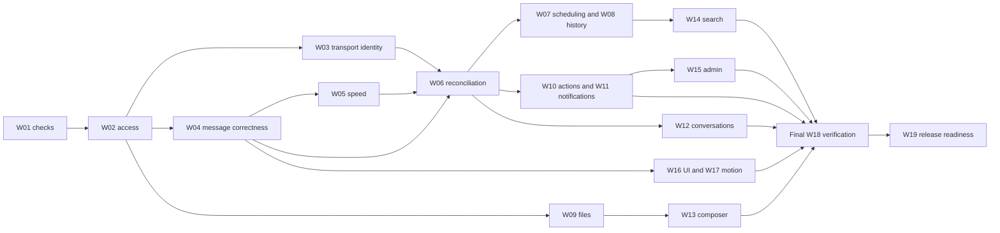

# Implementation timeline and scope controls

[Index](README.md) · [Work packages](implementation.md) · [Features](features.md) · [Direct messages](direct-messages.md) · [Release gates](testing.md)

## Current full-program schedule

The [P00–P14 delivery plan](delivery-plan.md) is now the authoritative cross-package execution sequence, including all catalogue features, phase gates and a separately estimated **65–124 independent QA days**. [Traceability](delivery-traceability.md) connects every feature and route to that sequence, and [repair plan](repair-plan.md) keeps the deployed callback and incomplete session-lifecycle checks ahead of release approval. The historical incremental estimates below remain useful accounting subtotals; earlier recommended orders defer to the complete phase sequence.

The full program now estimates 165–309 developer/shared-test days before contingency. With 20% developer contingency, overlapping dedicated QA and a final QA tail, the conservative single-developer plan is approximately **41–76 focused calendar weeks**, before external delays and reduced allocation. Staffing/start dates remain unassigned; all ranges need recalibration after the first measured slice. The original eight-hour target remains a restricted milestone.

## Actual progress and the next implementation sequence

Implementation began after the local GitHub OAuth path was repaired. The latest complete suite passes 228 automated tests across 53 files in unit, component and integration projects; focused search/DM/avatar/message-access runs pass 83 tests across 10 files, and current typecheck, production build and full-repository lint pass. GitHub Actions run 36124016907 passed the documented gates on current pushed commit `52345d1`; the current D02/D03 slices add test-first keyboard/touch message actions, named compact-safe profile controls, viewport-bounded Activity/channel-details surfaces and dynamic workspace height. The W04 interactive send path now persists a stable actor-scoped intent key, deduplicates concurrent/retried requests and reuses completed attachment uploads during an in-page retry. W39 group creation also persists a stable intent key and private request hash, so lost-response, concurrent and page-reload retries resolve to one group while changed-payload and cross-creator reuse are rejected. The candidate also includes documented workspace/channel/message/profile/search/file-upload/direct-message authorization, allowlist-based message HTML sanitization at write and read boundaries, safe plain-text system-event writes, an access-checked member directory with one-click DM entry, a dedicated Direct messages sidebar, a pair-keyed one-to-one model, a responsive DM inbox with database-bounded activity pages, participant/latest-message/unread summaries and server-side unread filtering, one-to-one/group recipient creation, new-generation group expansion, group rename/leave actions after membership shrinks, stable stacked participant avatars across the sidebar, inbox and conversation header (including groups with two active members and the one-active-member group-marker fallback), mobile Back navigation, per-user composer draft restore/clear behavior and logout purge, participant-aware conversation header and composer placeholder, forwarding, scheduled edit/send-now/cancellation, invite-link copy, bookmark privacy filtering, access-filtered notification paging and relational mark-read, focused-conversation-only message hydration, published-reply invalidation for thread and root timeline caches, preference and invite flows without broad route invalidation, Next.js 16 proxy/login matcher regressions, validated post-login return paths, safe auth-error messaging and a functional account-menu sign-out control. Search now has query/actor-bound keyset pagination, a tested GIN substring path, bounded filter parsing, visible invalid-input feedback, explicit date semantics, bounded old-message context navigation, reply-to-thread routing, restoration to the latest timeline, retryable context failures and component-tested history/viewport restoration. The [DM contract](direct-messages.md) records the implemented F13/F52 creation and inbox slices and the remaining group lifecycle, privacy, media, offline, mobile and governance work. Local browser evidence B07–B09 verifies requested-route return, logout and protected-route denial; B11 verifies only basic route-level Back/Forward. Deliberate hosted workflow failure propagation, deployed callback, expiry/error recovery, broader cold/filtered/concurrent and production-region search performance, live search/saved/notification Back/Forward, focus/scroll/mobile journeys and independent full-feature QA remain open gates. Five opt-in runs on the fixed 100k-message local search fixture recorded selective warm p50 12.08–52.47ms and p95 13.53–121.68ms; see [performance evidence](performance.md).

The next sequence is dependency-first:

1. **Close P00/P01:** local tests/typecheck/build/lint are green and the workflow file exists in the working tree, but GitHub returns 404 for it on the remote default branch; hosted CI has not run. After the reviewed candidate and workflow reach the remote, verify the first run and deliberate-failure propagation. B07–B09 cover local sign-in return/logout/protected-route denial; B10 shows the named OAuth app has a local callback, but deployment-to-client-ID mapping is unknown. Confirm that mapping, obtain action-time authorization before changing redirect settings, then verify deployed callback, expiry/error paths, realtime identity and independent two-actor access.
2. **Continue W05/P02 speed work:** channel unread counts, DM activity pages, notification pagination, channel-notification read updates and search page transfer have bounded PostgreSQL paths and TDD coverage. Sidebar and destination-list projections are narrowed; workspace membership prevents stale channel rows from surviving revocation; the sidebar owns unread state and the focused view owns message hydration. Schedule creation/edit/cancel/send-now and channel/DM lifecycle mutations use owning client views and have regressions against full-route invalidation; preferences and invite acceptance no longer refresh broad route trees. Remaining audit: verify other cache contracts; the status-based reconnect catch-up has component coverage, while real network-loss and multi-tab convergence still need browser evidence; trace initial message hydration and mounted-shell bursts; measure cold/warm production-build latency, production-region behavior and the remaining search/load profiles. Five opt-in 100k-message search runs cover six query shapes, an eight-request burst and natural/forced plans; natural GIN selection varied, so this does not establish a speedup. B11 verifies only basic route-level Back/Forward; deep-link query, viewport/focus restoration and mobile behavior remain next. Private-object delivery and draft sync remain open.
3. **Complete daily hubs:** saved items, members/profile routes, settings preferences, channel administration, unreads and thread inbox; direct messages now have a distinct data type and sidebar section.
4. **Complete DM foundations, then prototype platform capabilities:** ship the R23/R24 DM inbox and participant/privacy decisions, then group DMs, push/email delivery, voice/video transport and meeting scheduling only after the access and job foundations pass. Follow the ordered [DM sequence](direct-messages.md#ordered-dm-implementation-plan).
5. **Run QA continuously:** every completed slice updates the feature and route ledger with exact evidence; anything unrun stays NOT RUN.

The timeline is recalibrated after each package exit. It is not shortened by counting partial UI work as a completed feature.

## The one-day constraint

The user requires a day. Plan **eight focused implementation hours for one engineer**, with existing development credentials and a usable isolated test environment available at the start. Staffing was not specified, so this is an explicit capacity assumption. If the real team differs, allocate work by the dependency graph rather than multiplying speed by headcount.

The day is a timebox for a restricted, verified candidate, not a promise to finish all feature areas or achieve every performance budget. It is especially risky because full lint fails and the deployed OAuth callback and production security configuration remain unverified. If prerequisites or access isolation cannot be completed, deliver the internal candidate plus evidence and remaining blockers that day; do not call it launch-ready.

The assessment did not include an implementation start date; the authorized implementation follow-up began on 19 September 2026. `H0` remains the start of any future timeboxed milestone. This document does not schedule background work.

## Before H0

Needed inputs: working test accounts in two isolated workspaces, database/storage/realtime configuration access, known deployment target, package-manager choice, and confirmation that test data is disposable. Missing external access consumes the day; it is not silently excluded from elapsed time. Existing production credentials or data must not be used for destructive tests.

## Eight-hour critical path

| Window | Work and exact scope | Evidence / exit gate | Cut if over time |
|---|---|---|---|
| H0–H1 | W01 subset: establish runner/isolated fixture and meaningful failing behavior check, reproduce type/lint/build baseline; only then begin a test-driven repair | Required test discovery, failure reporting and safe fixture work; intended red recorded; exact build blockers known | If the test foundation is not ready, continue foundation work and report an internal milestone; no implementation-first bypass |
| H1–H3.5 | W02/W03 subset: write failing access/transport tests, then secure enabled boundaries; test-first server gating of unsafe features | Two-workspace/private-channel negative tests; 30-minute realtime identity decision inside this window | Gate search/files/schedules/admin/DM/forward/activity; disable unproven live transport |
| H3.5–H5 | W04/W06 subset: red/green messaging slice for safe read/send/retry and multi-client convergence; thread only with its tests | Two-account send/read; failed/uncertain send handled; no future/reply leakage | Threads and ancillary actions cut if they prevent reliable main conversation |
| H5–H6 | W05 subset: establish failing query-bound tests, batch unread work and bound inbox/read updates | 50-channel count policy, 26-DM two-page cursor, notification page/read semantics, targeted sidebar/search/forward projections, workspace revocation check, single-owner message hydration, preference/invite mutation behavior, and no broad route invalidation for message, schedule, DM and channel mutations; client view-refresh tests pass; four statements observed for the regular-channel summary fixture | Remaining projections, reconnect/multi-tab verification of duplicate suppression, cold/warm route latency and broader search variants remain open; hydration, search indexes, upload changes and virtualization stay later |
| H6–H6.75 | W16/W17 subset: test-first primary mobile, focus, loading/error and reduced-motion repairs | Core journey keyboard/narrow/reduced-motion pass | No theme redesign, new library, or broad component refactor |
| H6.75–H8 | W18/W19 subset: regression, build, deployment readiness, rollback and candid release report | No tenant/content blocker; verified enabled paths; documented cuts and measured results | No public release if trust/build gates fail; preserve internal candidate |

These windows sum to eight hours and have no hidden extra polish day. They are aggressive timeboxes, not independent estimates of complete packages. The 2.5-hour access window in particular may be insufficient; that is a known no-go trigger rather than permission to skip authorization.

## Decision gates

### H1: test-foundation and build gate

If the test harness cannot prove a meaningful intended red/green cycle safely, continue foundation work instead of implementing features first. If local type/build failures cannot be resolved, continue only toward a reviewable internal result. Do not rely on `ignoreBuildErrors`. Keep an explicit lint baseline: no new errors in touched files and no conditional-hook failures in enabled flows. The complete baseline product later requires a clean, justified lint configuration and passing checks.

### H3.5: trust gate

No unauthorized channel reads, writes, invitations, uploads, notifications or subscription payloads. Every cut feature is also guarded at its action/route/transport. Unknown RLS means live transport is not approved. If the enabled core cannot pass, reserve the remaining time for evidence and fixes rather than expanding functionality.

### H5: core gate

An authorized user reaches an accessible channel, reads, sends, observes acknowledgement or recoverable failure, and retains input on errors. A second client sees canonical state. If polling is used, disclose the fallback and its update interval. Threads are conditional, not a reason to destabilize main messaging.

### H8: delivery decision

Produce one of: **restricted candidate passed**, **internal candidate with blockers**, or **blocked by named external prerequisite**. List exact enabled/disabled features and verification results. Public deployment is a separate action unless explicitly requested in that implementation session; this assessment authorizes none.

## Day-one scope envelope

**Target:** F01, core F02/F04/F15–F17, essential F24/F40/F41/F42/F43/F44, and deployment safety subset of F45. F19 threads and existing simple actions remain conditional on passing checks. Core does not mean every future acceptance criterion for these features is complete in eight hours.

**Default cuts:** scheduling, private file sharing, unverified search, DM creation/forwarding, incomplete admin controls, notification delivery preferences, presence claims, full theme work, persistent drafts, large-history virtualization, and architectural file moves unrelated to correctness. Preserve records; do not delete data to meet scope.

**Forbidden cuts:** test-first implementation, required automated checks, authorization, safe content rendering, real failure state, cache identity isolation, data-preserving behavior, meaningful verification and truthful release reporting.

## Assessed baseline forecast, revised for TDD

The complete baseline is the sum of W01–W19, not the eight-hour subset. W01 and W18 include the mandatory TDD foundation and shared test program; W17 now budgets a complete shared motion system and representative core surfaces. The package table is the authority for individual ranges. The total is **37–70 focused engineer-days** before contingency. Add approximately 20% for integration uncertainty and fixes: **44.4–84 engineer-days**. At five focused days/week, that is roughly **9–17 weeks for one engineer**. This is a planning range, not a deadline promise or a demand that the user accept a larger scope.

If the day-one effort closes actual package work, subtract its recorded completed effort from the forecast; do not subtract one day from every partially touched package. Expansion W20 is excluded. External auth/provider changes, new compliance requirements, or a substantially larger scale can change the range.

| Sequence | Packages / milestone | Dependency rationale |
|---|---|---|
| 1. Establish trust and baseline | W01, W02, W03, core W04; start W18/W19 | Everything else relies on correct access and reproducibility |
| 2. Reliable fast conversation | Remaining W04, W05, W06, W08 | Coherent message model before deep history and optimization |
| 3. Complete existing product promises | W07, W09, W10, W11, W12, W13 | Publication/files/notifications depend on the same invariants |
| 4. Retrieval and administration | W14, W15 | Source visibility and message identity must be stable |
| 5. Finish experience and release | W16, W17, remaining W18/W19 | UI work can occur per feature earlier; full cross-feature verification closes release |

This dependency graph permits future parallel team work but no subagents or parallel implementation were used or requested in this assessment.

## Expanded production-route forecast

The follow-up request adds the product destinations in [routes](routes.md), not more work inside the eight-hour timebox. Target a restricted candidate on day one only if the test-foundation, trust and core gates pass; otherwise deliver the documented internal foundation milestone. Prioritize expanded navigation after those gates. The baseline forecast above includes the revised TDD foundation; incremental feature scope remains visible separately.

| Scope | Focused effort before contingency | With 20% contingency | Sequence |
|---|---|---|---|
| W01–W19 baseline, including TDD and shared motion system | 37–70d | 44.4–84d | Updated for TDD and expanded animation scope |
| Incremental W21–W25 production destinations | 11–21d | 13.2–25.2d | Routes/onboarding → daily hubs; preferences and retrieval on their dependencies; admin completion |
| Combined recommended production experience | 44.5–85.5d | 53.4–102.6d | Approximately 11–20.5 focused weeks for one engineer |
| Additional W26 maturity | 3–6d | 3.6–7.2d | Moderation, data requests and reminders after explicit policy choices |
| Combined with W26 | 47.5–91.5d | 57–109.8d | Approximately 11.5–22 focused weeks for one engineer |

This is an incremental planning model, not an obligation to build every page or a calendar commitment. Estimates include feature-specific validation; they exclude conditional billing/apps/enterprise scope and external provider delays. W25 includes its P2 audit interface; other P2 capabilities are in W26. Avoid double counting existing search/file/DM engine work in the route packages.

**First additions to prioritize:** thread inbox, DM inbox, all unread, drafts and notification controls because they serve repeated daily work. Home should remain a small composition of those summaries. Files/search routes follow when secure underlying retrieval is ready. Full governance and data lifecycle are later than getting workday navigation correct, while the underlying security rules remain mandatory throughout.

## Ten-feature collaboration expansion forecast

The [90-feature catalogue](features.md) contains both existing/partial capabilities and proposed scope. The ten new additions F69–F78 have incremental packages W27–W30. This estimate covers those additions after the earlier dependencies; it is not an estimate of the complete current catalogue, because that historical subtotal did not include the capabilities now allocated in W31–W39.

| Scope | Before contingency | With 20% contingency | Delivery interpretation |
|---|---|---|---|
| W27 polls, emoji, keyword rules and saved searches | 6–10d | 7.2–12d | Small independently releasable features after their core dependencies |
| W28 voice notes | 3–5d | 3.6–6d | After private media and browser/codec validation |
| W29 groups, templates and acknowledgement requests | 5–9d | 6–10.8d | After roles and publication/notification correctness |
| W30 tasks and notes | 7–12d | 8.4–14.4d | After routing/retrieval; due alerts require reminder support |
| New collaboration increment | **21–36d** | **25.2–43.2d** | Approximately 5–9 additional focused weeks for one engineer |
| Earlier production scope including W26 plus this increment | **68.5–127.5d** | **82.2–153d** | Approximately 16.5–31 focused weeks for one engineer, excluding W20 |

Recommended product order is saved searches and simple templates first, then polls/emoji, followed by groups/acknowledgements and keyword rules, then voice/tasks/notes on their dependencies. This can split package execution without double-counting package estimates. Measure actual delivery after each slice and replace the forecast with observed throughput. Do not interpret the table as approval to implement now or as a calendar deadline.

This earlier subtotal excludes group DMs, external notifications, offline use and integrations; W36/W39 now allocate them below. Calls, meeting AI and enterprise features were outside this earlier subtotal; they are included in the current catalogue and the full-platform forecast below. The one-day restricted candidate remains unchanged.

## Full Slack/Discord-style product forecast

The target now includes the bounded contracts in [calls and meetings](calls-and-meetings.md) and [production platform](production-platform.md). The small earlier candidate is a milestone, not the completed product. W31–W39 close the previous undefined calls/enterprise/native/notification scopes. These are low-confidence program estimates requiring revision after provider, identity, shared-channel and native prototypes; they are not measured development velocity.

| Increment | Engineer-days before contingency | Delivery gate |
|---|---|---|
| W31 live communication foundation | 12–22 | Real two-user voice, admission/revocation, then video/share/huddles/rooms/history |
| W32 meetings and calendars | 6–10 | Stable event identity, recurring timezone semantics, cancellation-safe reminders, verified provider sync |
| W33 captions and meeting artifacts | 8–16 | Processor selection, explicit consent, private artifact lifecycle and access tests |
| W34 community and advanced roles | 8–14 | Permission migration, moderated stages, forums and tested anti-abuse controls |
| W35 guests and shared channels | 8–16 | Bilateral policy, current-access enforcement across all derived surfaces |
| W36 workflows and integration platform | 10–18 | Scoped installations, finite steps, idempotency and secure external events |
| W37 identity, import and governance | 12–24 | One initial import format/identity integration; tested recovery and hold/deletion semantics |
| W38 native clients and language support | 15–30 | Shared APIs, real OS/media prototypes, signing/updates and target-device evidence |
| W39 group DMs, email/push and offline text | 14–26 | Conversation privacy, delivery policy, bounded opt-in offline behavior |
| **New platform increment W31–W39** | **93–176** | Excludes procurement, stores, external audits and provider approvals |
| **Development and shared-test packages** | **165–309** | Earlier W01–W19/W21–W30 total 72–133, plus 93–176; W20 counted zero times; dedicated QA capacity separate |
| **Development allowance including 20% contingency** | **198–370.8** | Roughly 40–75 focused weeks for one developer; dedicated QA provisional allowance 65–124d, scheduled separately; not a team calendar promise |

This forecast covers the bounded first versions documented for all 90 catalogue capabilities, not unlimited competitor parity. W38 is especially uncertain; native release breadth may expand its estimate. Contingency is an accounting allowance, not a statistical confidence interval. Do not divide the solo estimate by team size and present that as a committed deadline: permissions, provider integrations and end-to-end verification have serial dependencies.

Recommended implementation milestones after the initial candidate:

1. **Dependable messaging:** W01–W19, production navigation W21–W25, and W39 messaging/notification foundations. Build trust, history, search and files before amplifying them with new processors.
2. **Live collaboration:** W31 voice → video/screen share → huddles/rooms/history. Small secure media prototype starts after access and realtime identity are known, not after every cosmetic feature.
3. **Scheduled collaboration:** W32 events/recurrence/calendar; W33 captions and recording only after consent/processor readiness. Message scheduling W07 and personal reminders W26 remain separate capabilities on shared job foundations.
4. **Community and collaboration:** W27–W30 plus W34 forums/roles/stages/safety, sequenced per dependencies. W35 sharing follows role policy and agreed retention semantics.
5. **Automation and organizational maturity:** W36 workflows/apps and W37 identity/migration/governance. W38 dedicated clients and language support follow stable contracts and can have separate platform releases.

For a team, parallelize UI, media, backend/platform and verification only after agreeing interfaces and access semantics. No provider provisioning or unrequested expansion work is performed during this assessment follow-up. Record each milestone's enabled features and deferred contracts; do not call a chat-only release the completed target.

## TDD effort and sequencing update

The explicit test-everywhere requirement increases shared foundation effort: W01 is now 2–4d (previously 0.5–1.5d), W18 is 5–9d (previously 2–3d), adding **4.5–8.5 engineer-days** before contingency. All subtotal tables above have been recomputed. Individual feature packages already include their own verification; their tests must now be written first. Do not add the same feature-test work again to W18 or apply an unexplained percentage to every package.

These ranges are provisional planning judgments. Use the first complete W04 test-first slice to measure authoring, fixture, integration, review and CI costs, then re-estimate each later package from that evidence. Coverage legacy debt, real-device capacity and provider setup may expand the ranges. Report that uncertainty rather than claiming full TDD is free or guaranteeing the old delivery time.

W18 starts with W01; feature implementation cannot race ahead of its tests. Each milestone closes code and evidence together, including mobile and relevant live-provider contracts. The final release pass reruns integrated acceptance; it is not the first time tests are written. Within the one-day timebox, reduce scope or deliver an internal test-foundation milestone if necessary, while preserving red/green/refactor and release gates.

## Progress reporting template

### Dedicated QA workstream

Add an independent QA engineer from W01 onward: review acceptance and fixtures before implementation, verify ready slices during each milestone, reproduce defects and retest repairs, then sign off the integrated candidate. Development remains responsible for TDD; W18 remains shared test infrastructure and cross-feature orchestration. The [QA role](qa-engineer.md#staffing-schedule-and-handoff) and [checklist](qa-checklist.md) define ownership and evidence.

The existing 165–309 engineer-day base forecast covers development/shared-test work, not a newly staffed dedicated QA person's complete effort. The [full delivery plan](delivery-plan.md#capacity-and-relative-timeline) now adds a separate provisional **65–124 QA-day allowance**, including preparation, execution/device/provider coverage, motion/reduced-motion review, defect investigation, retest and a 4–8-day final regression reserve. This replaces the earlier unestimated QA line. Calibrate it against the first messaging slice; it is a planning judgment, not measured throughput. Do not add QA twice to developer test allocations or assume a QA engineer halves elapsed delivery time. Calendar planning is incomplete until this capacity is assigned.

The animation-rich requirement changed the estimate in this revision: W17 rises from 0.5–1.5d to 4–7d for shared tokens/primitives, coordinated-motion prototypes and core surfaces; feature packages remain responsible for their own transition design and tests. P02 independent QA rises by 1–2d for device/reduced-motion and interruption review. This adds 3.5–5.5 developer days and 1–2 QA days to the previous program envelope. The estimate still requires profiling and a representative design prototype before runtime selection.

Maintain two tracks: ready-to-build slices and ready-for-QA slices. Start with at most two packages awaiting QA, then adjust to measured throughput. A release waits for independent QA on its enabled scope; a one-day result without that execution remains an internal candidate with no QA sign-off. All 90 features remain in the final inventory even when intermediate releases enable a subset.

### Reporting

Include independent QA executor/run, PASS/FAIL/BLOCKED/NOT RUN/OUT OF SCOPE counts for features and routes separately, open defect severity, fix-retest status and evidence freshness. No combined feature/route percentage or zero-bug claim replaces the actual results.

Mobile acceptance is part of each milestone, following [mobile sequencing and estimate treatment](mobile-responsive.md#implementation-sequencing-and-estimate-treatment). Establish the phone shell/composer patterns before expanding screens; add adaptive UI with each feature and validate physical-device behavior before rollout. The earlier estimates already include responsive work but remain provisional against the stronger route/device matrix. Re-estimate W16, W18 and affected feature packages from measured gaps; no duplicate mobile package or invented extra duration is added in this documentation round. The day-one candidate must pass its enabled mobile core or remain an internal candidate.

Record: hours spent; package/feature IDs; evidence produced; enabled surface; server-gated cuts; before/after performance; unresolved risks; next smallest task. Avoid “90% done” without feature acceptance evidence. At the end of the day, the quality of the scope decision is part of the deliverable.
